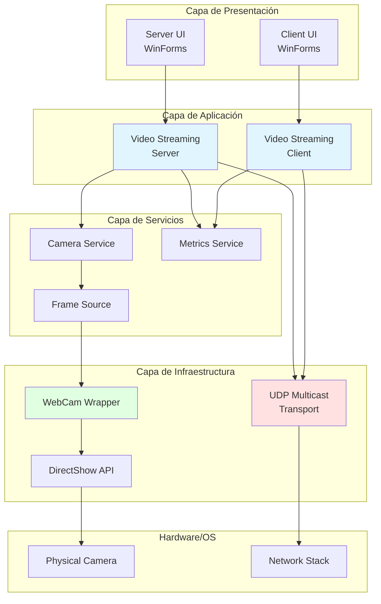
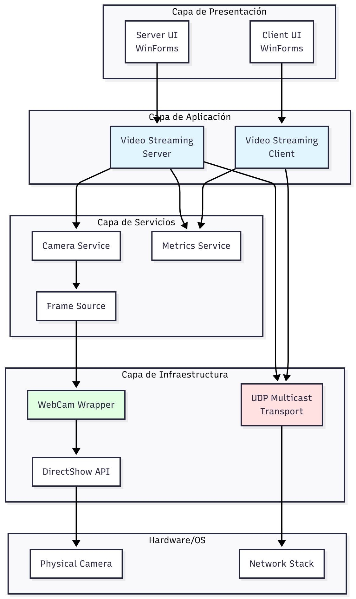
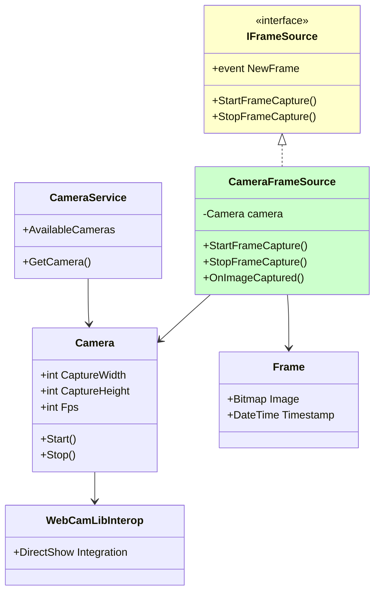
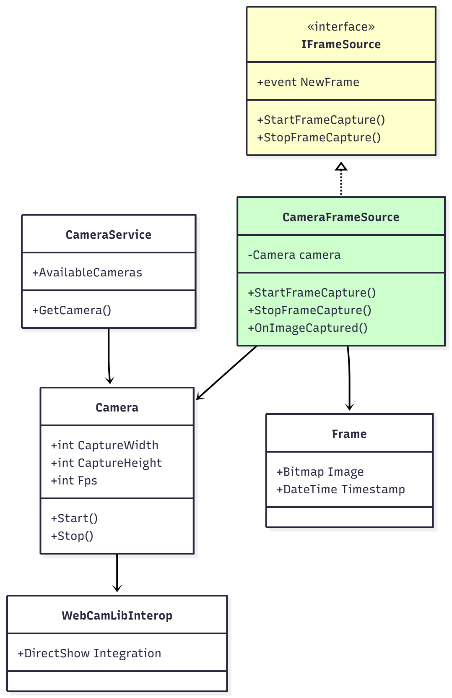
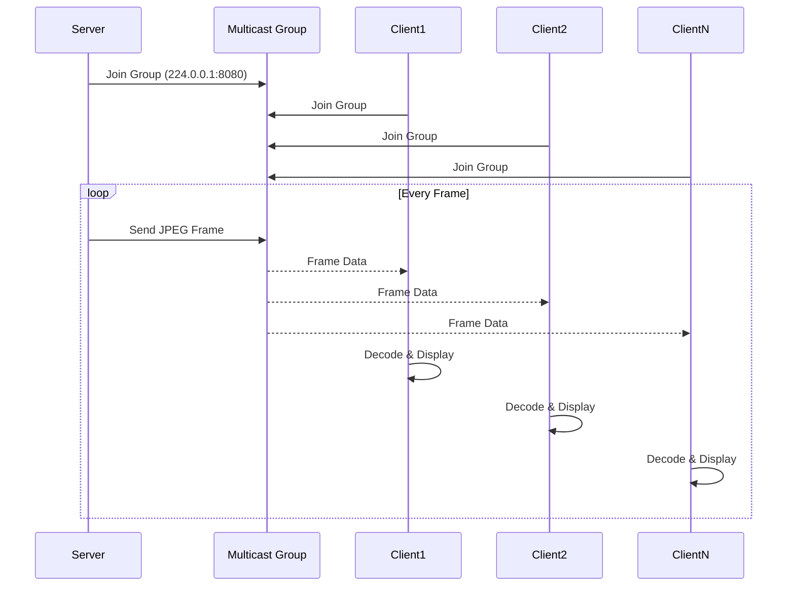
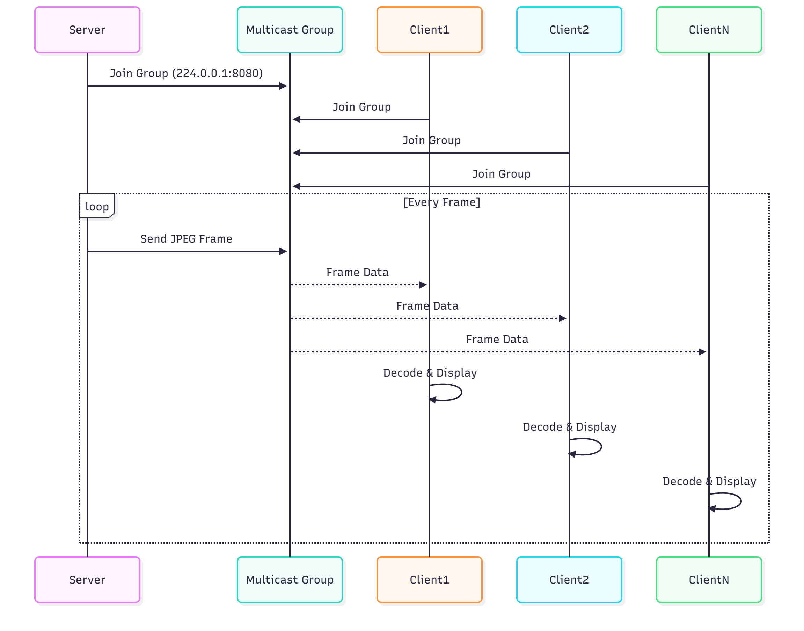
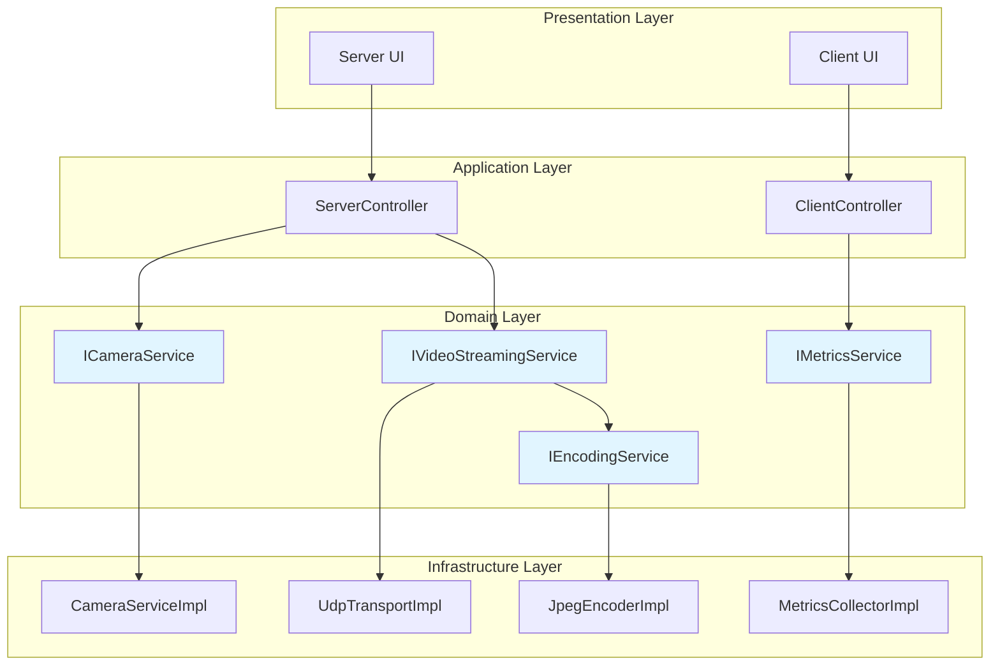
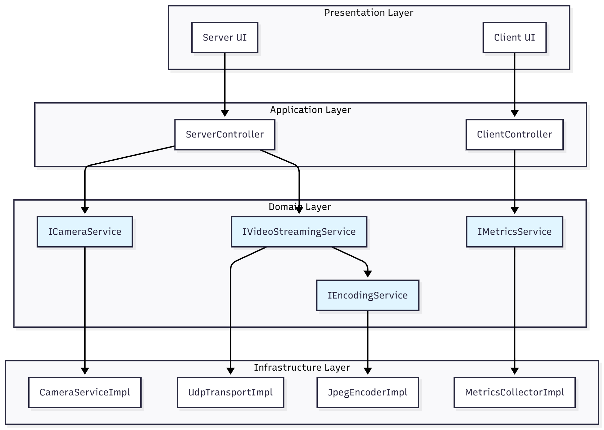
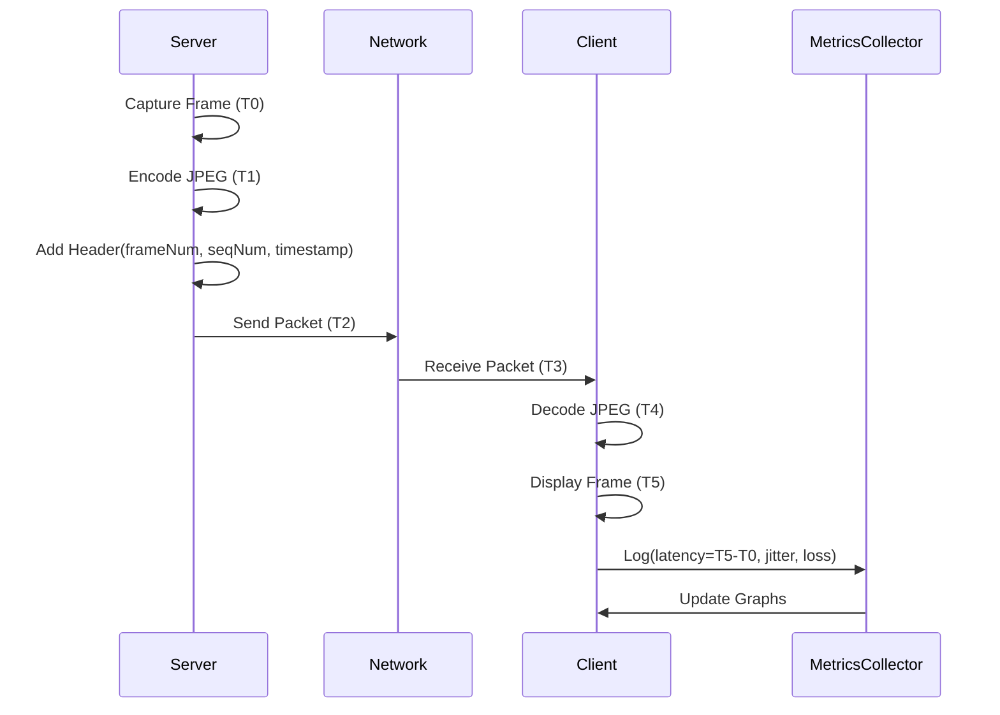
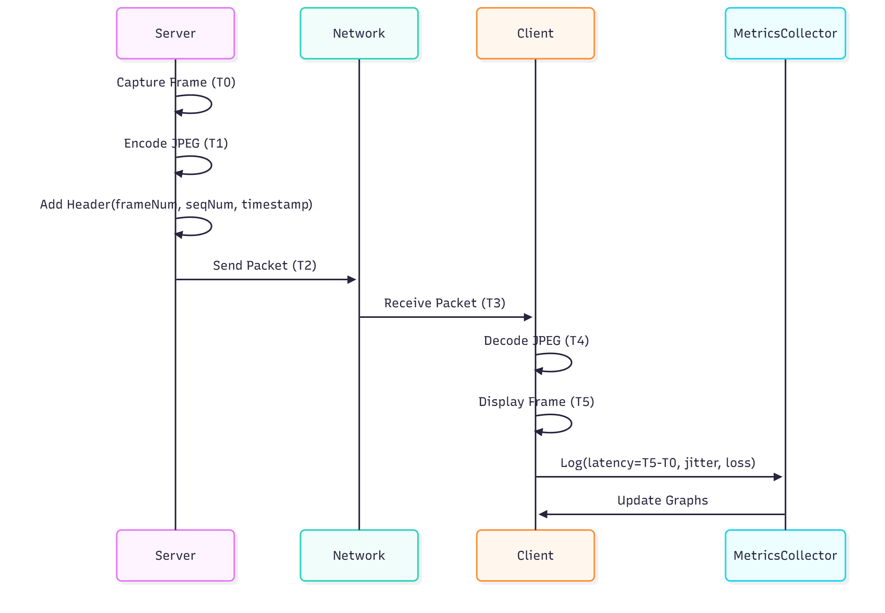

# Arquitectura del Sistema - Digital Laboratory Contents

**Generado por:** architect-agent  
**Fecha:** 2025-10-10  
**Repositorio:** DigitalLaboratoryContents  
**Commit:** ed9328d  

---

## 1. Visión General del Sistema

Este repositorio contiene material docente y práctico para la asignatura "Laboratorio de Contenidos Digitales" (Universidad Politécnica de Cartagena). El sistema principal implementa una **aplicación de videoconferencia basada en comunicaciones Multicast UDP** para transmisión de video y audio en tiempo real.

### 1.1 Objetivos del Sistema

- Capturar video desde cámara web y transmitirlo vía UDP Multicast
- Implementar cliente de recepción y visualización de streams de video
- Proporcionar medición de prestaciones (latencia, jitter, pérdida de paquetes)
- Soportar transmisión de audio con codificación A-law
- Servir como plataforma educativa para conceptos de streaming multimedia

---

## 2. Arquitectura de Alto Nivel




---

## 3. Componentes Principales

### 3.1 WebcamUDPMulticast (Server)

**Responsabilidad:** Capturar video de cámara y transmitir frames vía UDP Multicast

**Tecnologías:**
- .NET Framework / .NET 9.0
- WinForms para UI
- DirectShow para captura de video
- System.Net.Sockets para networking

**Componentes clave:**
- `Form1.cs` - Interfaz principal del servidor
- `CameraFrameSource` - Fuente de frames de cámara
- `CameraService` - Servicio de gestión de cámaras
- UDP Multicast sender

**Flujo de datos:**
```
Camera → DirectShow → WebCamWrapper → FrameSource → JPEG Encoding → UDP Multicast
```

### 3.2 WebcamUDPMulticast_cliente (Client)

**Responsabilidad:** Recibir y visualizar streams de video multicast

**Componentes clave:**
- Receptor UDP Multicast
- Decodificador JPEG
- Visualizador de frames
- Medición de métricas (latencia, jitter, pérdida de paquetes)

**Flujo de datos:**
```
UDP Multicast → Buffer → JPEG Decoding → Image Display → Metrics Collection
```

### 3.3 WebCamWrapper

**Responsabilidad:** Abstracción de la API DirectShow para captura de video

**Arquitectura interna:**




**Contratos principales:**
- `IFrameSource` - Interface para fuentes de frames
- `IObjectDetector` - Interface para detección de objetos (extensible)
- `ITouchlessAddIn` - Interface base para add-ins

---

## 4. Arquitectura de Red

### 4.1 Protocolo UDP Multicast




**Parámetros de red:**
- Dirección Multicast: `224.0.0.1`
- Puerto UDP: `8080` (configurable)
- Formato de frame: JPEG
- Resolución típica: 320x240 pixels
- FPS objetivo: 20 frames/segundo

### 4.2 Estructura de Paquetes (con métricas)

Para evaluación de prestaciones, los paquetes incluyen cabecera:

```
┌─────────────────────────────────────────────┐
│ Header (Metadata)                           │
├─────────────────────────────────────────────┤
│ - Frame Number (int)                        │
│ - Packet Sequence Number (int)              │
│ - Timestamp (long/DateTime)                 │
│ - Payload Length (int)                      │
├─────────────────────────────────────────────┤
│ Payload (JPEG Fragment)                     │
│ - Variable size (optimized for fluidity)   │
└─────────────────────────────────────────────┘
```

---

## 5. Patrones de Diseño Identificados

### 5.1 Observer Pattern
**Implementación:** Event-driven architecture en `IFrameSource`
```csharp
public interface IFrameSource
{
    event Action<IFrameSource, Frame, double> NewFrame;
}
```
**Uso:** Notificación de nuevos frames disponibles desde la cámara

### 5.2 Service Locator Pattern
**Implementación:** `CameraService`
```csharp
CameraService.AvailableCameras // Lista de cámaras disponibles
```
**Uso:** Descubrimiento y acceso a cámaras del sistema

### 5.3 Facade Pattern
**Implementación:** `WebCamWrapper`  
**Uso:** Simplifica acceso a la compleja API DirectShow

### 5.4 Adapter Pattern
**Implementación:** `WebCamLibInterop`  
**Uso:** Adapta API nativa de DirectShow a interfaces .NET

---

## 6. Análisis de Principios SOLID

### ✅ Single Responsibility Principle (SRP)
**Cumplimiento: BUENO**
- `CameraService` - Solo gestiona descubrimiento de cámaras
- `CameraFrameSource` - Solo captura frames
- `Frame` - Solo representa datos de frame

**Recomendación:** Separar lógica de UI de lógica de negocio en `Form1.cs`

### ✅ Open/Closed Principle (OCP)
**Cumplimiento: BUENO**
- Uso de interfaces (`IFrameSource`, `IObjectDetector`) permite extensión sin modificación
- Nuevas fuentes de video pueden implementar `IFrameSource`

### ✅ Liskov Substitution Principle (LSP)
**Cumplimiento: BUENO**
- `CameraFrameSource` puede sustituir a `IFrameSource` sin romper funcionalidad

### ⚠️ Interface Segregation Principle (ISP)
**Cumplimiento: ACEPTABLE**
- `ITouchlessAddIn` podría ser demasiado genérica
- **Recomendación:** Evaluar si todos los clientes necesitan todos los métodos

### ⚠️ Dependency Inversion Principle (DIP)
**Cumplimiento: MEJORABLE**
- Dependencia directa de `Form1` en implementaciones concretas
- **Recomendación:** Introducir inyección de dependencias para servicios

---

## 7. Detección de Code Smells y Anti-patrones

### 7.1 Tight Coupling

**Observación:** UI (`Form1`) acoplada a lógica de red y captura
```csharp
// En Form1.cs
_frameSource.NewFrame += OnImageCaptured;
// + lógica UDP directa en el mismo formulario
```

**Recomendación:** Introducir capa de servicios intermedia
```csharp
public interface IVideoStreamingService
{
    void StartStreaming();
    void StopStreaming();
    event Action<Frame> FrameReady;
}
```

### 7.2 God Object

**Riesgo:** `Form1.cs` probablemente maneja demasiadas responsabilidades (UI, networking, encoding)

**Recomendación:** Refactorizar en:
- `VideoStreamingController` - Orquestación
- `JpegEncodingService` - Codificación de frames
- `MulticastTransportService` - Envío UDP

### 7.3 Threading sin Abstracción

**Observación:** Uso directo de `Thread`/`Task` sin abstracción

**Recomendación:** Considerar patrón Producer-Consumer con `BlockingCollection<T>`

---

## 8. Arquitectura Propuesta (Refactorizada)




**Beneficios:**
- Separación clara de responsabilidades
- Testabilidad mejorada (mocking de interfaces)
- Facilita cambio de implementaciones (ej: cambiar de DirectShow a MediaFoundation)
- Cumplimiento estricto de DIP

---

## 9. Métricas y Evaluación de Prestaciones

### 9.1 Métricas Clave

| Métrica | Descripción | Target |
|---------|-------------|--------|
| **Latencia** | Tiempo desde captura hasta visualización | < 200ms |
| **Jitter** | Variación en latencia entre frames | < 50ms |
| **Frame Rate** | Frames por segundo entregados | 15-20 FPS |
| **Packet Loss** | Porcentaje de paquetes perdidos | < 5% |
| **Bandwidth** | Ancho de banda consumido | ~500 Kbps - 2 Mbps |

### 9.2 Arquitectura de Medición



---

## 10. Tecnologías y Dependencias

### 10.1 Stack Tecnológico

- **.NET Framework / .NET 9.0** - Runtime principal
- **WinForms** - Framework de UI
- **DirectShow** - API de captura de video (Windows)
- **System.Net.Sockets** - Networking UDP
- **System.Drawing** - Procesamiento de imágenes
- **NAudio** (opcional) - Captura/reproducción de audio

### 10.2 Dependencias Externas

- **WebCamLib** - Librería de interoperabilidad DirectShow
- **ALaw** (opcional) - Codec de compresión de audio
- **NAudio** (NuGet) - Audio processing

---

## 11. Estructura de Directorios

```
DigitalLaboratoryContents/
├── src/
│   ├── lab/                          # Laboratorios individuales
│   │   ├── Lab1/                     # Práctica 1
│   │   ├── Lab2/                     # Práctica 2
│   │   └── Lab3/                     # Práctica 3
│   └── project/                      # Proyecto principal
│       ├── WebcamUDPMulticast/       # Servidor de streaming
│       │   ├── WebcamUDPMulticast/   # Aplicación servidor
│       │   ├── WebCamWrapper/        # Librería de captura
│       │   └── WebCamLib/            # Interop DirectShow
│       └── WebcamUDPMulticast_cliente/ # Cliente de recepción
│           ├── WebcamUDPMulticast/   # Aplicación cliente
│           ├── WebCamWrapper/        # Librería compartida
│           └── WebCamLib/            # Interop DirectShow
├── lib/
│   ├── theory/                       # Material teórico
│   └── practices/                    # Guías de prácticas
├── agents/                           # Agentes de automatización
├── context/                          # Contexto del repositorio
└── docs/                             # Documentación
```

---

## 12. Recomendaciones de Mejora

### 12.1 Arquitectura

1. **Implementar Clean Architecture**
   - Separar capas de dominio, aplicación e infraestructura
   - Inyección de dependencias con Microsoft.Extensions.DependencyInjection

2. **Introducir Repository Pattern**
   - Para almacenamiento de configuraciones y métricas
   - Facilita testing y cambio de persistencia

3. **Implementar Unit of Work**
   - Para transacciones de métricas y logging

### 12.2 Código

1. **Async/Await sobre Thread directo**
   ```csharp
   // Preferir:
   await Task.Run(() => CaptureLoop());
   
   // Sobre:
   Thread t = new Thread(CaptureLoop);
   t.Start();
   ```

2. **Usar IDisposable correctamente**
   - Implementar dispose pattern en servicios con recursos no administrados
   - Usar `using` statements

3. **Logging estructurado**
   - Integrar Serilog o NLog
   - Logs categorizados por severidad

### 12.3 Testing

1. **Unit Tests**
   - Crear tests para `CameraService`, `Frame`, encoding/decoding logic
   - Target: >80% code coverage en capa de dominio

2. **Integration Tests**
   - Tests de comunicación UDP local
   - Tests de encoding/decoding pipeline

3. **Performance Tests**
   - Benchmarks de encoding speed
   - Tests de throughput de red

### 12.4 Seguridad

1. **Validación de entrada**
   - Validar tamaño de paquetes recibidos
   - Prevenir buffer overflow

2. **Encriptación** (opcional para producción)
   - Considerar DTLS sobre UDP para streams sensibles

3. **Autenticación**
   - Implementar mecanismo de autenticación para unirse al grupo multicast

---

## 13. Conclusiones

El sistema presenta una arquitectura funcional orientada a fines educativos con oportunidades claras de mejora arquitectónica. Los principales puntos son:

**Fortalezas:**
- ✅ Uso de interfaces para extensibilidad
- ✅ Separación conceptual en capas
- ✅ Implementación funcional de streaming multicast
- ✅ Código bien documentado con ejemplos

**Áreas de mejora:**
- ⚠️ Acoplamiento entre UI y lógica de negocio
- ⚠️ Falta de inyección de dependencias
- ⚠️ Testing insuficiente
- ⚠️ Threading sin abstracción adecuada

**Prioridad de refactorización:**
1. Separar lógica de negocio de UI (Form1.cs)
2. Introducir servicios con interfaces
3. Implementar tests unitarios
4. Añadir logging estructurado

---

## Anexos

### A. Glosario

- **Multicast**: Transmisión de datos a múltiples destinos simultáneamente
- **UDP**: User Datagram Protocol - protocolo de transporte sin conexión
- **DirectShow**: API de Microsoft para multimedia
- **A-law**: Algoritmo de compresión de audio
- **Jitter**: Variación en el retardo de paquetes
- **FPS**: Frames Per Second

### B. Referencias

- [DirectShow Documentation](https://docs.microsoft.com/en-us/windows/win32/directshow)
- [UDP Multicast Programming Guide](https://docs.microsoft.com/en-us/dotnet/api/system.net.sockets.udpclient)
- [SOLID Principles](https://en.wikipedia.org/wiki/SOLID)
- [Clean Architecture](https://blog.cleancoder.com/uncle-bob/2012/08/13/the-clean-architecture.html)

---

**Documento generado por architect-agent**  
**Modelo: opus**  
**Versión: 1.0**
