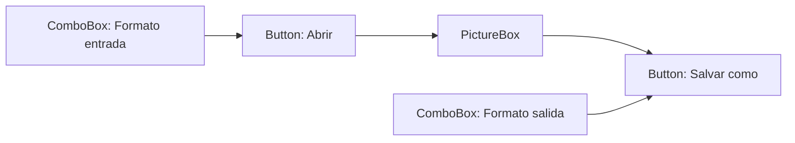
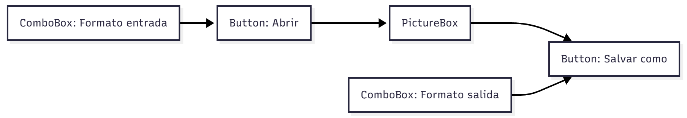
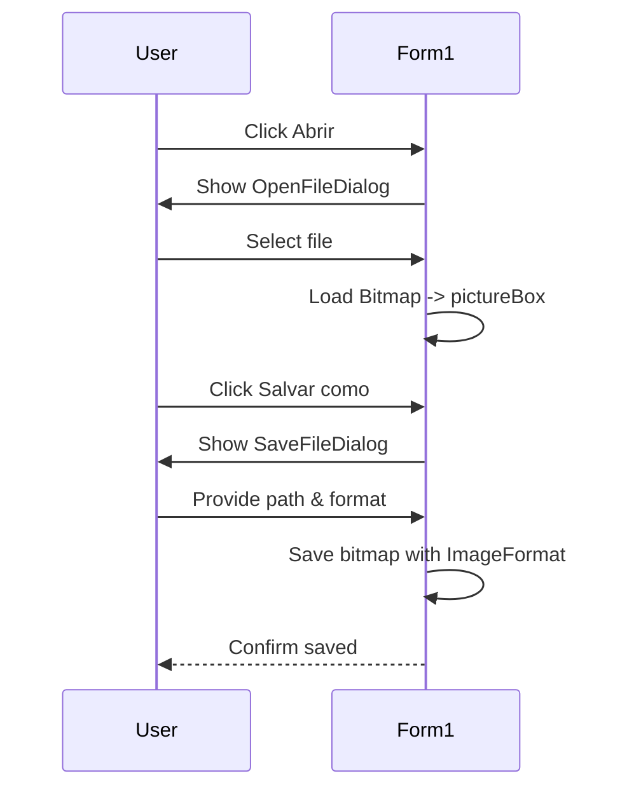
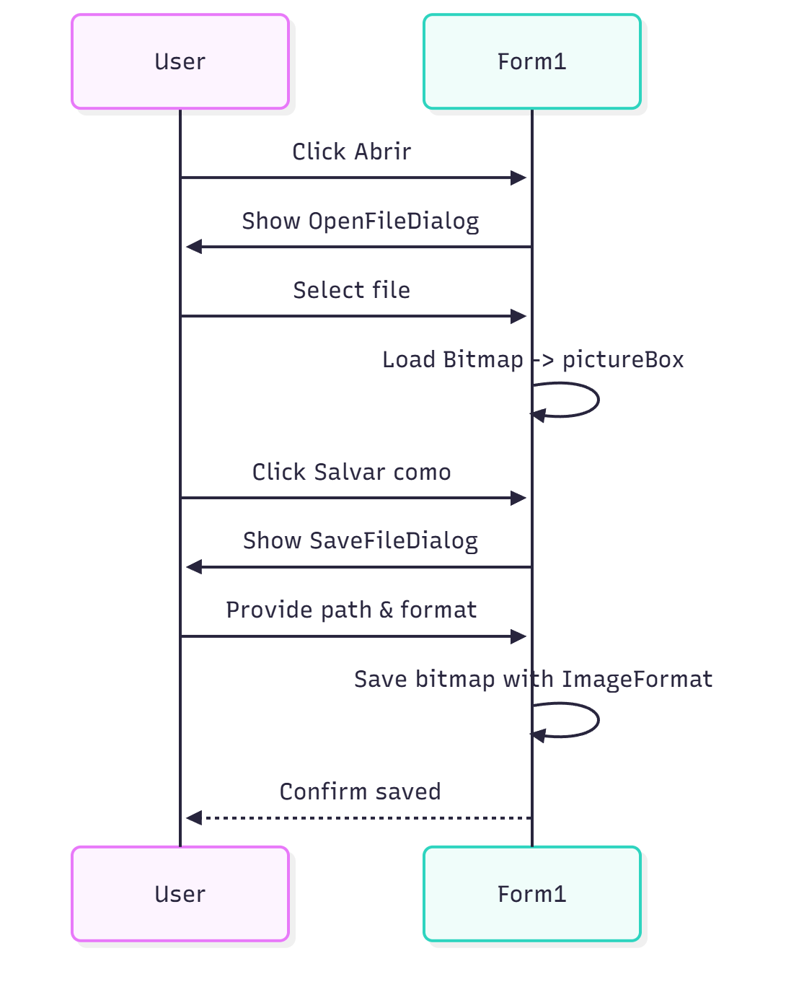

Universidad Politécnica de Cartagena

Escuela Técnica Superior de Ingeniería de Telecomunicación

LABORATORIO DE CONTENIDOS DIGITALES

Práctica 1: Convertidor de Imágenes

Profesores:
- Antonio Javier García Sánchez
- Rubén Martínez Sandoval

0. Objetivos
-------------

Desarrollar una aplicación Windows en C# para reproducir ficheros de imagen o PDF y convertirlos a distintos formatos de imagen (por ejemplo .bmp, .jpg, .gif, .tiff). El alumno debe implementar la UI y la lógica de apertura/guardado y conversión.

1. Diseño de la interfaz gráfica
--------------------------------

Pasos iniciales:

1. Abrir Visual Studio y crear un nuevo proyecto de tipo "Windows Forms Application".
2. En el formulario principal (Form1) colocar los controles necesarios:
   - 2 botones: "Abrir" y "Salvar como"
   - 2 ComboBox: formato de entrada y formato de salida
   - 1 PictureBox para mostrar la imagen cargada

Propiedades a ajustar:

- Cambiar la propiedad Text de los botones a "Abrir" y "Salvar como".
- Rellenar la propiedad Items de cada ComboBox con las opciones:
  - *.bmp
  - *.jpg
  - *.gif
  - *.tiff

Mermaid: diseño de la UI (vista simplificada)




2. Código asociado a la UI
--------------------------

Nota: Visual Studio autogenera el código del diseñador (Form1.Designer.cs). No editar manualmente ese archivo; usar el editor visual y el code-behind (Form1.cs).

2.1 Botón "Abrir"
-----------------

Objetivo: abrir un diálogo de selección de archivos, leer la imagen seleccionada y mostrarla en el PictureBox.

Ejemplo básico en C#:

```csharp
// Variable global dentro de la clase Form1
private System.Drawing.Bitmap currentBitmap;

private void btnAbrir_Click(object sender, EventArgs e)
{
    using (OpenFileDialog ofd = new OpenFileDialog())
    {
        ofd.Filter = this.comboBox1.Text + "|" + this.comboBox1.Text; // p.e. "*.jpg|*.jpg"
        DialogResult dr = ofd.ShowDialog();
        if (dr == DialogResult.OK)
        {
            // Liberar bitmap anterior si existe
            if (currentBitmap != null) { currentBitmap.Dispose(); currentBitmap = null; }

            currentBitmap = new System.Drawing.Bitmap(ofd.FileName);
            pictureBox1.Image = currentBitmap;

            // Ajustar tamaño del formulario si se desea
            this.Width = Math.Max(this.Width, currentBitmap.Width + 40);
            this.Height = Math.Max(this.Height, currentBitmap.Height + 100);
        }
    }
}
```

Puntos a tener en cuenta:

- Mantener la variable Bitmap como miembro de la clase para poder usarla en la conversión.
- Gestionar la liberación de recursos (Dispose) para evitar fugas.
- Comprobar que comboBox1.Text tiene valor antes de usarlo como filtro.

2.2 Botón "Salvar como"
-----------------------

Objetivo: abrir un diálogo SaveFileDialog y guardar el Bitmap en el formato seleccionado.

Ejemplo básico en C#:

```csharp
private void btnSalvar_Click(object sender, EventArgs e)
{
    if (currentBitmap == null) { MessageBox.Show("No hay imagen cargada."); return; }

    using (SaveFileDialog sfd = new SaveFileDialog())
    {
        sfd.Filter = this.comboBox2.Text + "|" + this.comboBox2.Text; // p.e. "*.png|*.png"
        DialogResult dr = sfd.ShowDialog();
        if (dr == DialogResult.OK)
        {
            var targetPath = sfd.FileName;
            var fmt = GetImageFormatFromCombo(this.comboBox2.Text);
            currentBitmap.Save(targetPath, fmt);
            MessageBox.Show("Imagen guardada: " + targetPath);
        }
    }
}

private System.Drawing.Imaging.ImageFormat GetImageFormatFromCombo(string text)
{
    switch (text.ToLower())
    {
        case "*.bmp": return System.Drawing.Imaging.ImageFormat.Bmp;
        case "*.jpg": return System.Drawing.Imaging.ImageFormat.Jpeg;
        case "*.gif": return System.Drawing.Imaging.ImageFormat.Gif;
        case "*.tiff": return System.Drawing.Imaging.ImageFormat.Tiff;
        default: return System.Drawing.Imaging.ImageFormat.Png;
    }
}
```

Diagrama de flujo: abrir, mostrar y guardar




3. Consideraciones adicionales
------------------------------

- Si la imagen es más grande que el formulario, calcular y ajustar Width/Height o usar barras de desplazamiento (AutoScroll = true en el formulario o panel con AutoScroll).
- Para PDFs: requerirás una librería que convierta páginas PDF a imágenes (por ejemplo, Pdfium, Ghostscript, iTextSharp + render, o bibliotecas comerciales). El flujo es: renderizar página del PDF a Bitmap y tratarla como imagen.
- Control de excepciones: envolver operaciones de IO en try/catch y mostrar mensajes de error adecuados.
- Pruebas con distintos formatos y tamaños para verificar fidelidad y manejo de memoria.

4. Entrega y criterios de evaluación
-----------------------------------

Se valorará:

- Interfaz funcional y clara.
- Conversión correcta entre formatos solicitados.
- Manejo correcto de recursos (Dispose), errores y validaciones.
- Código legible y comentado.

Sugerencias de mejora (opcional):

- Añadir soporte por lotes (convertir varias imágenes a la vez).
- Añadir opción para convertir todas las páginas de un PDF a varias imágenes.
- Añadir previsualización del formato de salida o parámetros de compresión para JPG/TIFF.
