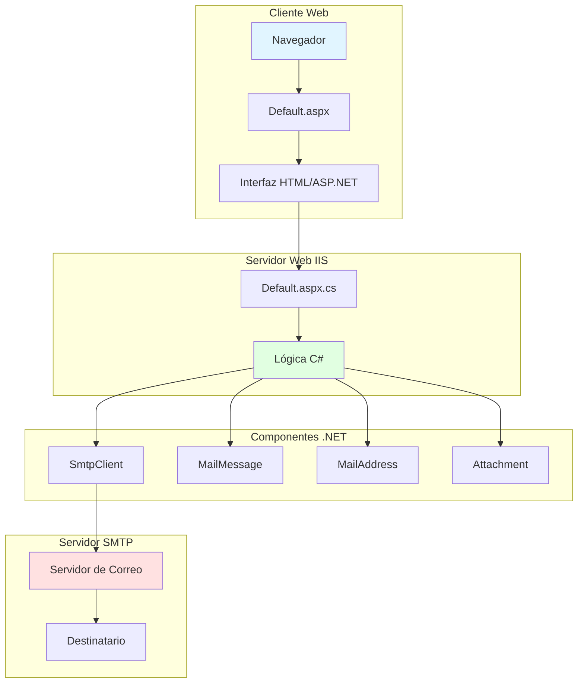
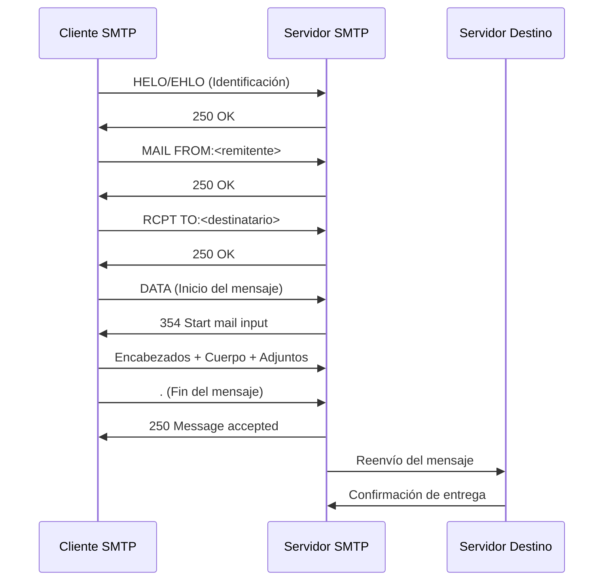
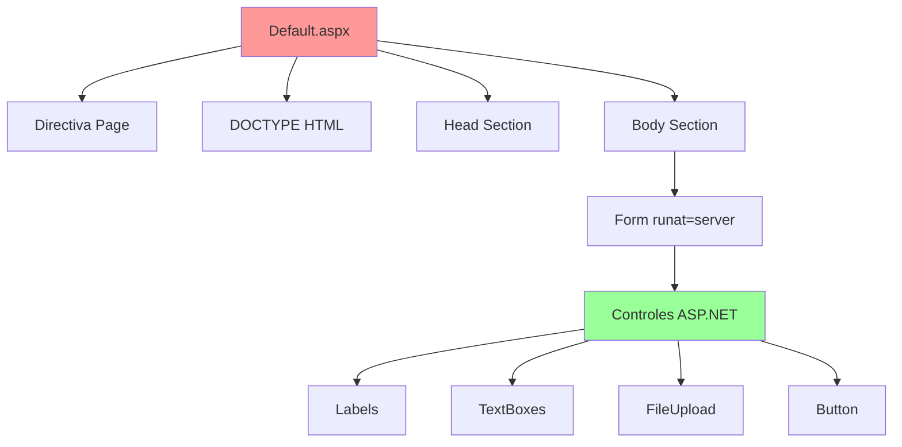
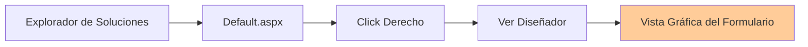
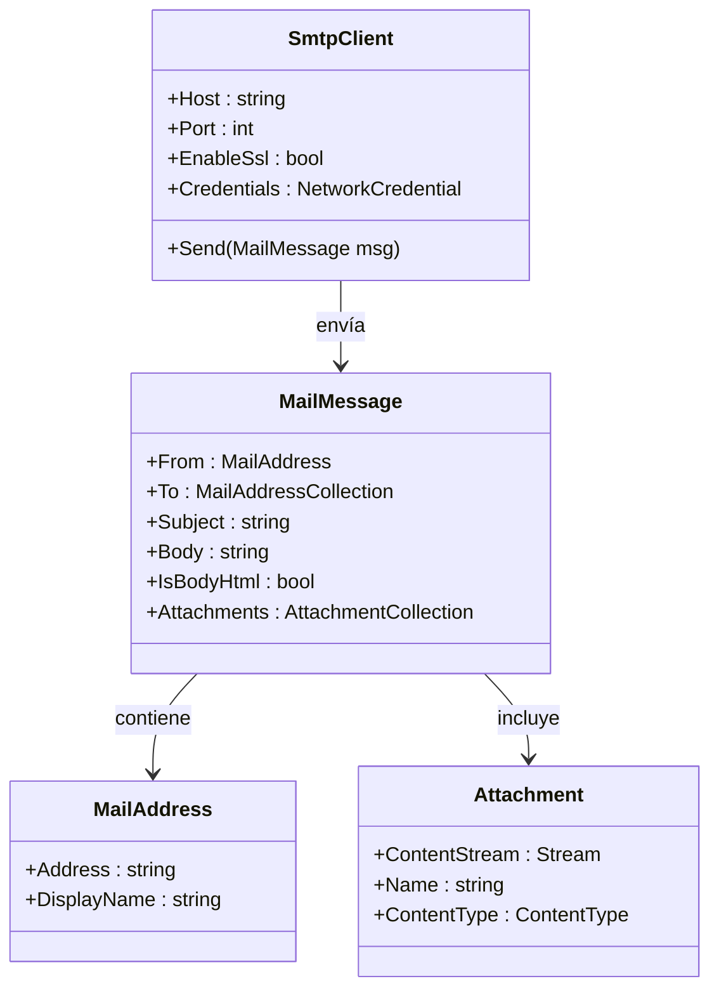
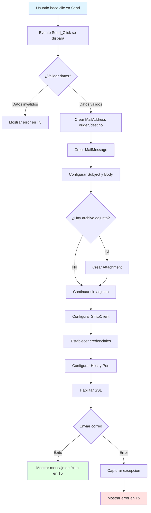
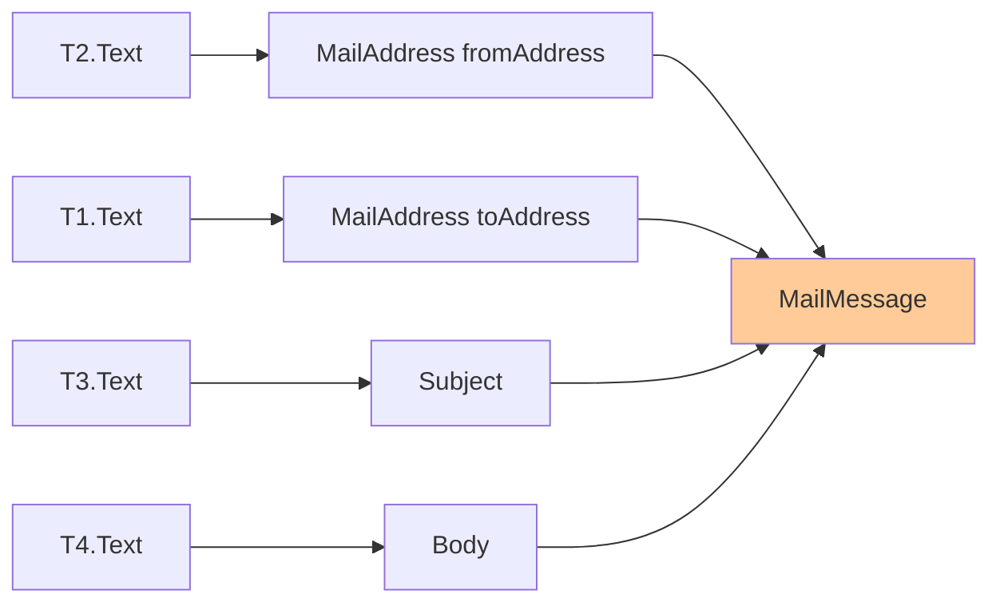
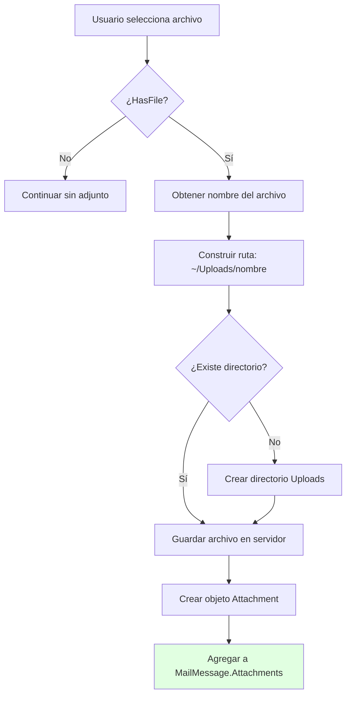
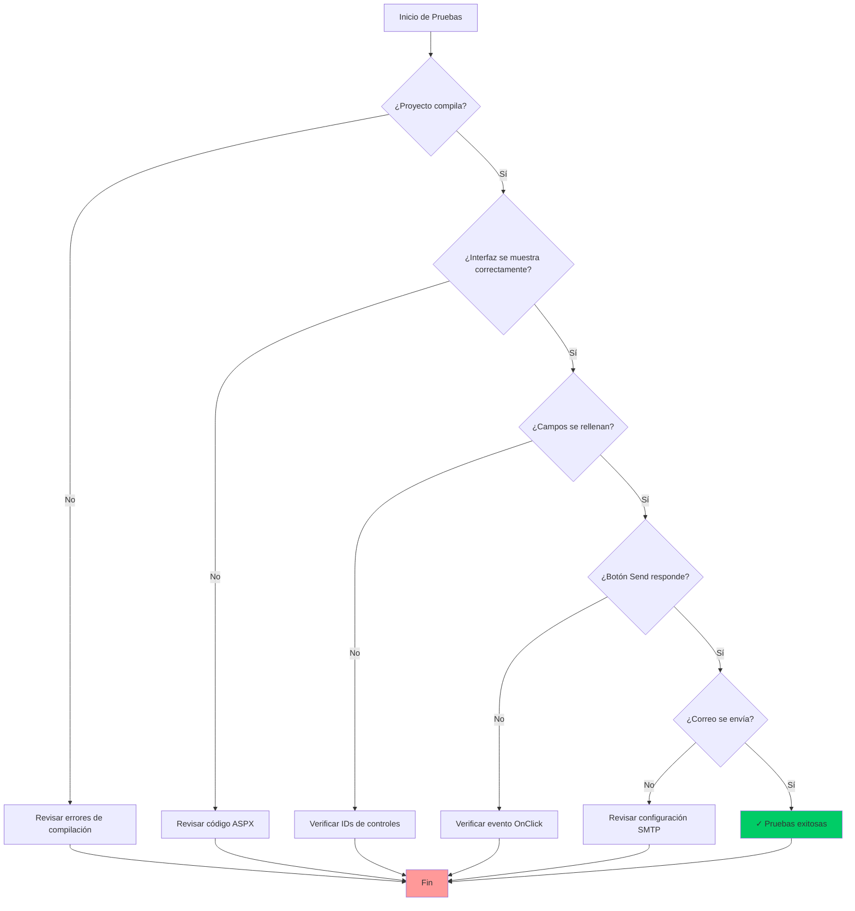

# Práctica 3: Aplicación Web ASP.NET - Cliente SMTP de Correo Electrónico

**Universidad Politécnica de Cartagena**  
**Escuela Técnica Superior de Ingeniería de Telecomunicación**  
**LABORATORIO DE CONTENIDOS DIGITALES**

**Profesores:**
- Antonio Javier García Sánchez
- Rubén Martínez Sandoval

---

## 📋 Índice

1. [Introducción y Objetivos](#introducción-y-objetivos)
2. [Fundamentos Teóricos](#fundamentos-teóricos)
3. [Configuración del Proyecto](#configuración-del-proyecto)
4. [Desarrollo del Frontend (HTML/ASP.NET)](#desarrollo-del-frontend)
5. [Implementación del Backend (C#)](#implementación-del-backend)
6. [Pruebas y Validación](#pruebas-y-validación)
7. [Referencias y Recursos](#referencias-y-recursos)

---

## 🎯 Introducción y Objetivos

### Descripción General

En esta práctica, desarrollarás una **aplicación web completa** utilizando **ASP.NET** que funciona como un **cliente de correo electrónico SMTP**. Esta aplicación permitirá a los usuarios enviar correos electrónicos con archivos adjuntos a través de una interfaz web intuitiva.

### Objetivos de Aprendizaje

Al completar esta práctica, serás capaz de:

- ✅ Crear y configurar un proyecto ASP.NET Web Forms desde cero
- ✅ Diseñar interfaces web utilizando controles ASP.NET
- ✅ Implementar la lógica de negocio en C# (code-behind)
- ✅ Utilizar el protocolo SMTP para envío de correos electrónicos
- ✅ Gestionar archivos adjuntos en aplicaciones web
- ✅ Manejar excepciones y mostrar mensajes de estado al usuario

### Arquitectura de la Aplicación



---

## 📚 Fundamentos Teóricos

### ¿Qué es ASP.NET Web Forms?

**ASP.NET Web Forms** es un framework de desarrollo web que permite crear aplicaciones web dinámicas utilizando un modelo de programación basado en eventos, similar al desarrollo de aplicaciones de escritorio.

#### Características Principales:

| Característica | Descripción |
|----------------|-------------|
| **Modelo Code-Behind** | Separa el diseño (HTML/ASPX) de la lógica (C#) |
| **Controles de Servidor** | Componentes reutilizables que generan HTML automáticamente |
| **ViewState** | Mantiene el estado de los controles entre postbacks |
| **Manejo de Eventos** | Responde a acciones del usuario (clicks, cambios, etc.) |

### Protocolo SMTP (Simple Mail Transfer Protocol)

SMTP es el protocolo estándar para el envío de correos electrónicos a través de Internet.



#### Puertos SMTP Comunes:

| Puerto | Tipo | Descripción |
|--------|------|-------------|
| **25** | Sin cifrado | Puerto SMTP estándar (bloqueado por muchos ISPs) |
| **587** | STARTTLS | Puerto recomendado para envío con cifrado TLS |
| **465** | SSL/TLS | Puerto SMTP sobre SSL (obsoleto pero aún usado) |

---

## 🔧 Configuración del Proyecto

### Paso 1: Crear el Proyecto ASP.NET

1. **Abrir Visual Studio**
2. **Crear nuevo proyecto:**
   - Archivo → Nuevo → Proyecto
   - Seleccionar: **"Aplicación web vacía de ASP.NET"**
   - Nombre del proyecto: `EmailClientASP`
   - Framework: `.NET Framework 4.7.2` o superior


### Paso 2: Estructura del Proyecto

Después de crear el proyecto, tendrás la siguiente estructura:

```
EmailClientASP/
│
├── Properties/
│   └── AssemblyInfo.cs
├── References/
│   ├── System.Web
│   ├── System.Net
│   └── ...
├── Web.config              # Configuración de la aplicación
├── Default.aspx            # Interfaz HTML/ASP.NET (Vista)
└── Default.aspx.cs         # Código C# (Lógica)
```

### Paso 3: Agregar el Formulario Web

1. **Click derecho** en el proyecto en el Explorador de Soluciones
2. Seleccionar **Agregar → Nuevo Elemento**
3. Buscar **"Formularios Web Form"** en la categoría **Web Forms**
4. Nombrar el archivo: `Default.aspx`
5. Click en **Agregar**

> 💡 **Nota:** El nombre `Default.aspx` es importante, ya que es la página predeterminada que se carga cuando se accede a la aplicación web.

---

## 🎨 Desarrollo del Frontend

### 1. Código HTML - Fichero Default.aspx

El archivo `Default.aspx` contiene la estructura HTML y los controles ASP.NET que forman la interfaz de usuario.

#### Estructura del Archivo ASPX



#### Código Base Proporcionado:

```aspx
<%@ Page Language="C#" AutoEventWireup="true" CodeFile="Default.aspx.cs" Inherits="_Default" %>

<!DOCTYPE html PUBLIC "-//W3C//DTD XHTML 1.0 Transitional//EN" 
    "http://www.w3.org/TR/xhtml1/DTD/xhtml1-transitional.dtd">

<html xmlns="http://www.w3.org/1999/xhtml">
<head id="Head1" runat="server">
    <title>Email Sending Application</title>
</head>
<body>
    <form id="form1" runat="server">
        <div>
            <table cellpadding="10" cellspacing="0" border="2" width="50%">
                <tr>
                    <td valign="top" style="padding-top:20px; background-color:#C0C0C0;">
                        
                        <!-- Campo: To (Destinatario) -->
                        <asp:Label ID="Label1" runat="server" Text="To" ForeColor="Black"></asp:Label>
                        &nbsp;&nbsp;&nbsp;&nbsp;&nbsp;
                        <asp:TextBox ID="T1" runat="server" BackColor="#C0FFFF"></asp:TextBox>
                        <br /><br />
                        
                        <!-- Campo: From (Remitente) -->
                        <asp:Label ID="Label2" runat="server" Text="From" ForeColor="Black"></asp:Label>
                        &nbsp;&nbsp;&nbsp;
                        <asp:TextBox ID="T2" runat="server" BackColor="#C0FFFF"></asp:TextBox>
                        <br /><br />
                        
                        <!-- Archivo Adjunto -->
                        <asp:Label ID="Label6" runat="server" Text="Attach" ForeColor="Black"></asp:Label>
                        <asp:FileUpload ID="fileAttach" runat="server" Width="578px" />
                        
                        <!-- Botón de Envío -->
                        <asp:Button ID="Send" runat="server" Text="Send" 
                                    OnClick="Send_Click" BackColor="#C0C000" ForeColor="Navy" />
                        
                    </td>
                </tr>
            </table>
        </div>
    </form>
</body>
</html>
```

#### Análisis de los Componentes Proporcionados:

| Control | ID | Propósito |
|---------|---------|-----------|
| `<asp:Label>` | Label1 | Etiqueta "To" para identificar el campo destinatario |
| `<asp:TextBox>` | T1 | Campo de texto para ingresar el correo del destinatario |
| `<asp:Label>` | Label2 | Etiqueta "From" para identificar el campo remitente |
| `<asp:TextBox>` | T2 | Campo de texto para ingresar el correo del remitente |
| `<asp:Label>` | Label6 | Etiqueta "Attach" para identificar el campo de adjuntos |
| `<asp:FileUpload>` | fileAttach | Control para seleccionar archivos a adjuntar |
| `<asp:Button>` | Send | Botón para enviar el correo (evento `Send_Click`) |

### 2. Controles a Implementar por el Alumno

Deberás agregar los siguientes controles adicionales para completar la interfaz:

#### Tabla de Controles Requeridos:

| Control Requerido | ID Sugerido | Propósito | Propiedades Recomendadas |
|-------------------|-------------|-----------|--------------------------|
| **Label** | Label3 | Etiqueta "Subject" | Text="Subject", ForeColor="Black" |
| **TextBox** | T3 | Campo para el asunto del correo | BackColor="#C0FFFF", Width="400px" |
| **Label** | Label4 | Etiqueta "Body" | Text="Body", ForeColor="Black" |
| **TextBox** | T4 | Campo para el cuerpo del mensaje | BackColor="#C0FFFF", TextMode="MultiLine", Rows="6", Width="400px" |
| **Label** | Label5 | Etiqueta "Status" | Text="List Status", ForeColor="Black" |
| **TextBox** | T5 | Campo para mostrar estado de envío | BackColor="#FFFFCC", TextMode="MultiLine", Rows="3", Width="400px", ReadOnly="true" |

#### Ejemplo de Código a Agregar (después de T2):

```aspx
<!-- Campo: Subject (Asunto) -->
<asp:Label ID="Label3" runat="server" Text="Subject" ForeColor="Black"></asp:Label>
&nbsp;&nbsp;&nbsp;
<asp:TextBox ID="T3" runat="server" BackColor="#C0FFFF" Width="400px"></asp:TextBox>
<br /><br />

<!-- Campo: Body (Cuerpo del mensaje) -->
<asp:Label ID="Label4" runat="server" Text="Body" ForeColor="Black"></asp:Label>
&nbsp;&nbsp;&nbsp;
<asp:TextBox ID="T4" runat="server" BackColor="#C0FFFF" 
             TextMode="MultiLine" Rows="6" Width="400px"></asp:TextBox>
<br /><br />

<!-- Campo: Status (Estado del envío) -->
<asp:Label ID="Label5" runat="server" Text="List Status" ForeColor="Black"></asp:Label>
<asp:TextBox ID="T5" runat="server" BackColor="#FFFFCC" 
             TextMode="MultiLine" Rows="3" Width="400px" ReadOnly="true"></asp:TextBox>
<br /><br />
```

### 3. Vista del Diseñador

Para visualizar cómo se ve tu interfaz gráficamente:

1. **Click derecho** en `Default.aspx` en el Explorador de Soluciones
2. Seleccionar **"Ver Diseñador"**
3. Verás una representación visual de tu formulario



#### Disposición Visual Esperada:

```
┌─────────────────────────────────────────────────────┐
│                EMAIL SENDING APPLICATION            │
├─────────────────────────────────────────────────────┤
│  To:       [______________________________]         │
│                                                     │
│  From:     [______________________________]         │
│                                                     │
│  Subject:  [______________________________]         │
│                                                     │
│  Body:     [______________________________]         │
│            [______________________________]         │
│            [______________________________]         │
│                                                     │
│  Attach:   [Seleccionar archivo...]                │
│                                                     │
│  Status:   [______________________________]         │
│            [______________________________]         │
│                                                     │
│                   [  SEND  ]                        │
└─────────────────────────────────────────────────────┘
```

---

## 💻 Implementación del Backend

### 1. Fichero Default.aspx.cs - Código C#

Este archivo contiene la lógica que se ejecuta en el servidor cuando el usuario interactúa con la aplicación.

#### Acceder al Código:

1. **Click derecho** en `Default.aspx` en el Explorador de Soluciones
2. Seleccionar **"Ver Código"**
3. Se abrirá el archivo `Default.aspx.cs`

### 2. Namespaces Necesarios

Agrega el siguiente `using` al inicio del archivo para acceder a las clases de correo electrónico:

```csharp
using System;
using System.Web;
using System.Web.UI;
using System.Web.UI.WebControls;
using System.Net.Mail;  // ⚠️ IMPORTANTE: Agregar esta línea
```

### 3. Clases Principales del Namespace System.Net.Mail



#### Descripción Detallada de las Clases:

| Clase | Propósito | Métodos/Propiedades Principales |
|-------|-----------|--------------------------------|
| **SmtpClient** | Cliente que se conecta al servidor SMTP y envía correos | `Host`, `Port`, `EnableSsl`, `Credentials`, `Send()` |
| **MailMessage** | Representa el mensaje de correo electrónico completo | `From`, `To`, `Subject`, `Body`, `Attachments` |
| **MailAddress** | Representa una dirección de correo electrónico | `Address` (string del email) |
| **Attachment** | Representa un archivo adjunto al correo | Constructor con ruta del archivo |

### 4. Implementación del Método Send_Click

Este es el método que se ejecuta cuando el usuario hace clic en el botón "Send".

#### Flujo de Ejecución:



#### Código Completo del Método:

```csharp
protected void Send_Click(object sender, EventArgs e)
{
    try
    {
        // 1. VALIDACIÓN DE CAMPOS
        if (string.IsNullOrWhiteSpace(T1.Text) || 
            string.IsNullOrWhiteSpace(T2.Text) ||
            string.IsNullOrWhiteSpace(T3.Text) ||
            string.IsNullOrWhiteSpace(T4.Text))
        {
            T5.Text = "[AGENT] Error: Todos los campos son obligatorios (excepto adjunto).";
            return;
        }

        // 2. CREAR DIRECCIONES DE CORREO
        MailAddress fromAddress = new MailAddress(T2.Text);  // Remitente
        MailAddress toAddress = new MailAddress(T1.Text);    // Destinatario

        // 3. CREAR MENSAJE DE CORREO
        MailMessage mailMessage = new MailMessage(fromAddress, toAddress);
        
        // 4. CONFIGURAR ASUNTO Y CUERPO
        mailMessage.Subject = T3.Text;
        mailMessage.Body = T4.Text;
        mailMessage.IsBodyHtml = false;  // Texto plano (cambiar a true para HTML)

        // 5. AGREGAR ARCHIVO ADJUNTO (si existe)
        if (fileAttach.HasFile)
        {
            string fileName = fileAttach.FileName;
            string filePath = Server.MapPath("~/Uploads/" + fileName);
            
            // Crear directorio si no existe
            if (!System.IO.Directory.Exists(Server.MapPath("~/Uploads/")))
            {
                System.IO.Directory.CreateDirectory(Server.MapPath("~/Uploads/"));
            }
            
            // Guardar archivo temporalmente
            fileAttach.SaveAs(filePath);
            
            // Crear y agregar adjunto
            Attachment attachment = new Attachment(filePath);
            mailMessage.Attachments.Add(attachment);
        }

        // 6. CONFIGURAR CLIENTE SMTP
        SmtpClient smtpClient = new SmtpClient();
        
        // Credenciales de autenticación
        smtpClient.Credentials = new System.Net.NetworkCredential(
            "prueba@qartia.com", 
            "mafsys-2dynba-nebtYx"
        );
        
        // Configuración del servidor
        smtpClient.Host = "qartia-com.correoseguro.dinaserver.com";
        smtpClient.Port = 587;
        smtpClient.EnableSsl = true;  // Habilitar cifrado SSL/TLS
        
        // Validación de certificado SSL (para servidores con certificados no confiables)
        System.Net.ServicePointManager.ServerCertificateValidationCallback = 
            new System.Net.Security.RemoteCertificateValidationCallback(
                RemoteServerCertificateValidationCallback
            );

        // 7. ENVIAR CORREO
        smtpClient.Send(mailMessage);

        // 8. MENSAJE DE ÉXITO
        T5.Text = "[AGENT] ✓ Correo enviado exitosamente a " + T1.Text + 
                  " desde " + T2.Text + 
                  "\nFecha: " + DateTime.Now.ToString("dd/MM/yyyy HH:mm:ss");
        
        // 9. LIMPIAR CAMPOS (opcional)
        T1.Text = "";
        T2.Text = "";
        T3.Text = "";
        T4.Text = "";
    }
    catch (Exception ex)
    {
        // 10. MANEJO DE ERRORES
        T5.Text = "[AGENT] ✗ Error al enviar correo:\n" + ex.Message;
        
        // Log adicional para debugging (opcional)
        System.Diagnostics.Debug.WriteLine("Error detallado: " + ex.ToString());
    }
}

// Método auxiliar para validar certificados SSL
private static bool RemoteServerCertificateValidationCallback(
    object sender,
    System.Security.Cryptography.X509Certificates.X509Certificate certificate,
    System.Security.Cryptography.X509Certificates.X509Chain chain,
    System.Net.Security.SslPolicyErrors sslPolicyErrors)
{
    return true;  // Acepta cualquier certificado (solo para desarrollo/pruebas)
}
```

### 5. Explicación Detallada por Bloques

#### Bloque 1: Validación de Campos

```csharp
if (string.IsNullOrWhiteSpace(T1.Text) || 
    string.IsNullOrWhiteSpace(T2.Text) ||
    string.IsNullOrWhiteSpace(T3.Text) ||
    string.IsNullOrWhiteSpace(T4.Text))
{
    T5.Text = "[AGENT] Error: Todos los campos son obligatorios (excepto adjunto).";
    return;
}
```

**Propósito:** Verificar que los campos obligatorios no estén vacíos antes de procesar el envío.

**Mejores Prácticas:**
- ✅ Validar también el formato de correo electrónico (usar expresiones regulares)
- ✅ Validar longitud máxima de asunto y cuerpo
- ✅ Sanitizar entradas para prevenir inyección de código

#### Bloque 2-4: Creación del Mensaje

```csharp
MailAddress fromAddress = new MailAddress(T2.Text);
MailAddress toAddress = new MailAddress(T1.Text);
MailMessage mailMessage = new MailMessage(fromAddress, toAddress);
mailMessage.Subject = T3.Text;
mailMessage.Body = T4.Text;
```

**Diagrama de Objetos:**



#### Bloque 5: Gestión de Archivos Adjuntos

```csharp
if (fileAttach.HasFile)
{
    string fileName = fileAttach.FileName;
    string filePath = Server.MapPath("~/Uploads/" + fileName);
    
    if (!System.IO.Directory.Exists(Server.MapPath("~/Uploads/")))
    {
        System.IO.Directory.CreateDirectory(Server.MapPath("~/Uploads/"));
    }
    
    fileAttach.SaveAs(filePath);
    Attachment attachment = new Attachment(filePath);
    mailMessage.Attachments.Add(attachment);
}
```

**Proceso de Adjuntos:**



**⚠️ Consideraciones de Seguridad:**

| Riesgo | Recomendación |
|--------|---------------|
| Archivos maliciosos | Validar extensiones permitidas (.pdf, .jpg, .docx, etc.) |
| Tamaño excesivo | Limitar tamaño máximo (ej: 5MB) |
| Nombres de archivo | Sanitizar nombres para evitar path traversal |
| Almacenamiento | Limpiar archivos temporales después del envío |

#### Bloque 6: Configuración del Cliente SMTP

```csharp
SmtpClient smtpClient = new SmtpClient();
smtpClient.Credentials = new System.Net.NetworkCredential(
    "prueba@qartia.com", 
    "mafsys-2dynba-nebtYx"
);
smtpClient.Host = "qartia-com.correoseguro.dinaserver.com";
smtpClient.Port = 587;
smtpClient.EnableSsl = true;
```

**Tabla de Configuración:**

| Propiedad | Valor | Descripción |
|-----------|-------|-------------|
| `Host` | `qartia-com.correoseguro.dinaserver.com` | Servidor SMTP |
| `Port` | `587` | Puerto STARTTLS (recomendado) |
| `EnableSsl` | `true` | Habilita cifrado TLS/SSL |
| `Credentials` | Usuario + contraseña | Autenticación en el servidor |

**Servidores SMTP Alternativos:**

```csharp
// OPCIÓN 1: Gmail (requiere "App Password" si 2FA está activo)
smtpClient.Host = "smtp.gmail.com";
smtpClient.Port = 587;
smtpClient.Credentials = new NetworkCredential("tu_email@gmail.com", "tu_app_password");

// OPCIÓN 2: Outlook/Hotmail
smtpClient.Host = "smtp-mail.outlook.com";
smtpClient.Port = 587;
smtpClient.Credentials = new NetworkCredential("tu_email@outlook.com", "tu_password");

// OPCIÓN 3: UPCT (Universidad Politécnica de Cartagena)
smtpClient.Host = "smtp.upct.es";
smtpClient.Port = 25;  // o 587
```

#### Bloque 7-10: Envío y Manejo de Errores

```csharp
try
{
    smtpClient.Send(mailMessage);
    T5.Text = "[AGENT] ✓ Correo enviado exitosamente...";
}
catch (Exception ex)
{
    T5.Text = "[AGENT] ✗ Error al enviar correo:\n" + ex.Message;
}
```

**Errores Comunes y Soluciones:**

| Error | Causa | Solución |
|-------|-------|----------|
| `SmtpException: Mailbox unavailable` | Email destino inválido | Validar formato del email |
| `AuthenticationException` | Credenciales incorrectas | Verificar usuario/contraseña |
| `SmtpException: 5.7.1` | Servidor requiere autenticación | Asegurar que `Credentials` esté configurado |
| `SocketException` | No hay conexión al servidor | Verificar `Host`, `Port` y firewall |
| `SSL/TLS negotiation failed` | Problema con certificado | Implementar `ServerCertificateValidationCallback` |

---

## 🧪 Pruebas y Validación

### 1. Casos de Prueba

#### Tabla de Casos de Prueba:

| ID | Escenario | Entrada | Resultado Esperado |
|----|-----------|---------|-------------------|
| **TC01** | Envío exitoso sin adjunto | To: valido@test.com<br>From: sender@test.com<br>Subject: Prueba<br>Body: Mensaje | ✓ "Correo enviado exitosamente" |
| **TC02** | Envío con adjunto pequeño (<1MB) | Campos válidos + archivo.pdf | ✓ Correo recibido con adjunto |
| **TC03** | Campo "To" vacío | To: (vacío)<br>Resto: válido | ✗ "Todos los campos son obligatorios" |
| **TC04** | Email inválido | To: correo_invalido<br>Resto: válido | ✗ "Error al enviar correo" |
| **TC05** | Credenciales incorrectas | Usuario/password erróneo | ✗ "AuthenticationException" |
| **TC06** | Adjunto grande (>10MB) | Archivo muy grande | ⚠️ Timeout o error de tamaño |

### 2. Checklist de Verificación



### 3. Depuración de Errores

#### Uso de Breakpoints:

1. Coloca un breakpoint en la primera línea de `Send_Click`
2. Ejecuta la aplicación en modo Debug (F5)
3. Llena el formulario y haz clic en Send
4. Inspecciona variables paso a paso (F10)

#### Logging para Debugging:

```csharp
// Agregar al inicio del método Send_Click
System.Diagnostics.Debug.WriteLine("=== INICIO ENVÍO DE CORREO ===");
System.Diagnostics.Debug.WriteLine("To: " + T1.Text);
System.Diagnostics.Debug.WriteLine("From: " + T2.Text);
System.Diagnostics.Debug.WriteLine("Subject: " + T3.Text);

// Agregar antes de smtpClient.Send()
System.Diagnostics.Debug.WriteLine("Enviando correo...");

// Agregar después del envío exitoso
System.Diagnostics.Debug.WriteLine("✓ Correo enviado correctamente");

// Agregar en el catch
System.Diagnostics.Debug.WriteLine("✗ Error: " + ex.ToString());
```

---

## 📖 Referencias y Recursos

### Documentación Oficial

| Recurso | URL |
|---------|-----|
| **ASP.NET Web Forms** | https://docs.microsoft.com/es-es/aspnet/web-forms/ |
| **System.Net.Mail Namespace** | https://docs.microsoft.com/es-es/dotnet/api/system.net.mail |
| **SmtpClient Class** | https://docs.microsoft.com/es-es/dotnet/api/system.net.mail.smtpclient |
| **MailMessage Class** | https://docs.microsoft.com/es-es/dotnet/api/system.net.mail.mailmessage |

### Tutoriales Adicionales

- 📹 [ASP.NET Web Forms Tutorial - Microsoft Learn](https://learn.microsoft.com/en-us/aspnet/web-forms/)
- 📹 [Sending Email in C# - CodeProject](https://www.codeproject.com/)
- 📖 [SMTP Protocol RFC 5321](https://tools.ietf.org/html/rfc5321)

### Herramientas Útiles

| Herramienta | Propósito |
|-------------|-----------|
| **Mailtrap.io** | Servidor SMTP de prueba (no envía correos reales) |
| **Postman** | Pruebas de APIs y servicios web |
| **Fiddler** | Análisis de tráfico HTTP/HTTPS |
| **Visual Studio Debugger** | Depuración de código C# |

### Glosario de Términos

| Término | Definición |
|---------|------------|
| **SMTP** | Simple Mail Transfer Protocol - protocolo para envío de correos |
| **TLS/SSL** | Transport Layer Security / Secure Sockets Layer - protocolos de cifrado |
| **Code-Behind** | Archivo C# asociado a una página ASPX que contiene la lógica |
| **Postback** | Evento que causa que la página se reenvíe al servidor |
| **ViewState** | Mecanismo para mantener el estado de controles entre postbacks |
| **MIME** | Multipurpose Internet Mail Extensions - formato para adjuntos |

---

## 🎓 Ejercicios Adicionales (Opcional)

### Ejercicio 1: Validación de Email con Expresiones Regulares

Implementa una función que valide el formato de los correos electrónicos:

```csharp
private bool IsValidEmail(string email)
{
    try
    {
        var regex = new System.Text.RegularExpressions.Regex(
            @"^[^@\s]+@[^@\s]+\.[^@\s]+$"
        );
        return regex.IsMatch(email);
    }
    catch
    {
        return false;
    }
}
```

### Ejercicio 2: Múltiples Destinatarios

Modifica la aplicación para permitir enviar correos a múltiples destinatarios separados por coma:

```csharp
string[] recipients = T1.Text.Split(',');
foreach (string recipient in recipients)
{
    mailMessage.To.Add(new MailAddress(recipient.Trim()));
}
```

### Ejercicio 3: Correos con Formato HTML

Permite al usuario enviar correos con formato HTML:

```csharp
mailMessage.IsBodyHtml = true;
mailMessage.Body = "<html><body><h1>Título</h1><p>" + T4.Text + "</p></body></html>";
```

### Ejercicio 4: Historial de Envíos

Implementa un sistema que guarde un log de todos los correos enviados en un archivo de texto:

```csharp
string logEntry = string.Format(
    "{0} | From: {1} | To: {2} | Subject: {3}\n",
    DateTime.Now,
    T2.Text,
    T1.Text,
    T3.Text
);
System.IO.File.AppendAllText(Server.MapPath("~/email_log.txt"), logEntry);
```

---

## ✅ Checklist Final

Antes de entregar tu práctica, asegúrate de que:

- [ ] El proyecto compila sin errores
- [ ] Todos los controles requeridos están implementados (To, From, Subject, Body, Attach, Status, Send)
- [ ] El código C# incluye el `using System.Net.Mail;`
- [ ] La configuración SMTP es correcta (Host, Port, Credentials, SSL)
- [ ] El método `Send_Click` está completo y funcional
- [ ] El manejo de excepciones está implementado (try-catch)
- [ ] Los mensajes de estado se muestran correctamente en el TextBox de Status
- [ ] La aplicación puede enviar correos sin adjuntos
- [ ] La aplicación puede enviar correos con adjuntos
- [ ] Has probado la aplicación con diferentes casos de prueba
- [ ] El código está comentado adecuadamente
- [ ] Has limpiado archivos temporales y código innecesario

---

## 📞 Soporte

Si encuentras problemas durante el desarrollo de la práctica:

1. **Revisa la documentación** proporcionada en este documento
2. **Consulta los mensajes de error** en el TextBox de Status y en la ventana de salida de Visual Studio
3. **Utiliza el debugger** para identificar el punto exacto del fallo
4. **Contacta a los profesores** en horario de prácticas para asistencia personalizada

---

**© 2024 Universidad Politécnica de Cartagena - Laboratorio de Contenidos Digitales**

*Documento redocumentado con fines educativos y formativos.*
