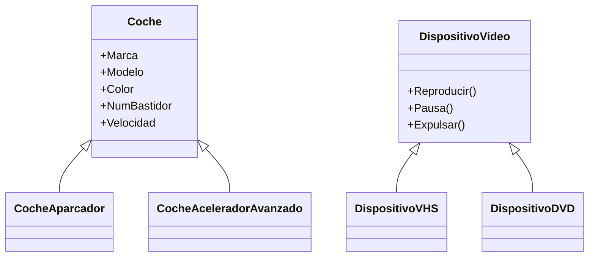
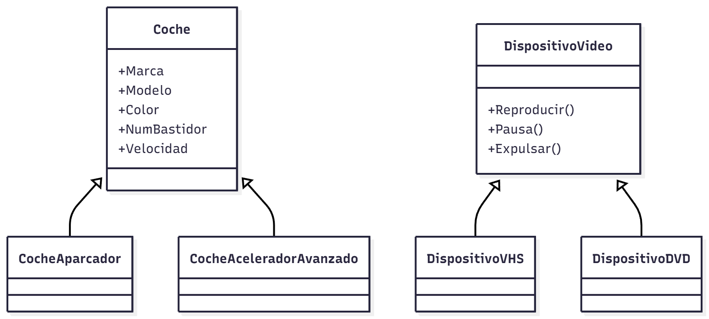
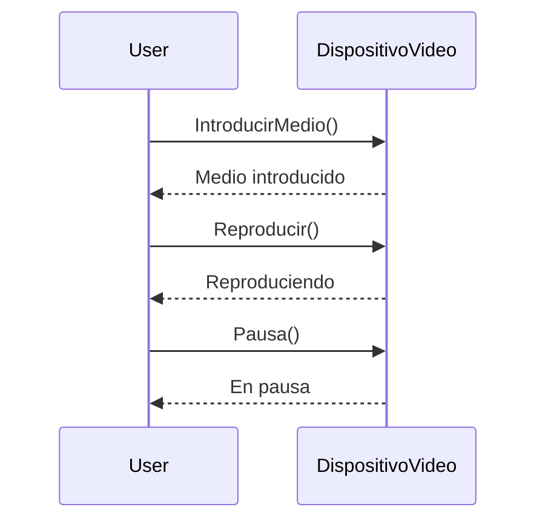
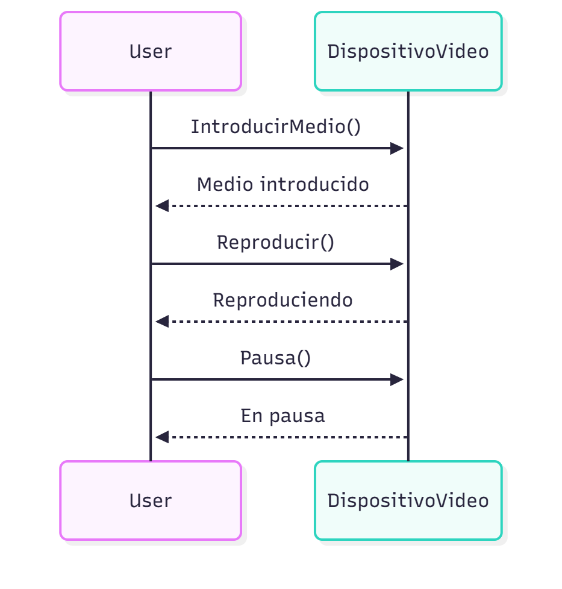

Iniciación al C#
=================

Laboratorio de Contenidos Digitales

Antonio Javier García Sánchez

Contenido
--------

- Clases y Objetos
- Características
- Espacio de Nombres
- Indicadores
- Operadores
- Primera aplicación en C#
- Métodos
- Campos
- Propiedades
- Constructores
- Recolector de basura
- Control de Flujo
- Arrays
- Estructuras
- Herencia y Polimorfismo
- Interfaces

Clases y Objetos
-----------------

Una clase es una plantilla en la que nos basamos para crear objetos.

- Clase → Coche (general)
- Objeto → Coche (particular)
- Objeto: Es una instancia de la clase a la que pertenece.

Ejemplo de clase Coche (C#):

```csharp
class Coche
{
    public Coche(string marca, string modelo, string color, string numbastidor)
    {
        this.Marca = marca;
        this.Modelo = modelo;
        this.Color = color;
        this.NumBastidor = numbastidor;
    }

    public double Velocidad
    {
        get { return this.velocidad; }
    }

    protected double velocidad = 0;
    public string Marca;
    public string Modelo;
    public string Color;
    public string NumBastidor;

    public void Acelerar(double cantidad)
    {
        Console.WriteLine("Incrementando la velocidad en {0} km/h", cantidad);
        this.velocidad += cantidad;
    }

    public void Girar(double cantidad)
    {
        Console.WriteLine("Girando el coche {0} grados", cantidad);
    }

    public void Frenar(double cantidad)
    {
        Console.WriteLine("Reduciendo la velocidad en {0} km/h", cantidad);
        this.velocidad -= cantidad;
    }
}
```

Ejemplo de uso (cliente):

```csharp
class EjemploCocheApp
{
    static void Main()
    {
        Coche MiCoche = new Coche("Peugeot", "306", "Azul", "1546876");
        Console.WriteLine("Los datos de mi coche son:");
        Console.WriteLine("Marca: {0}", MiCoche.Marca);
        Console.WriteLine("Modelo: {0}", MiCoche.Modelo);
        Console.WriteLine("Color: {0}", MiCoche.Color);
        Console.WriteLine("Número de bastidor: {0}", MiCoche.NumBastidor);
        MiCoche.Acelerar(100);
        Console.WriteLine("La velocidad actual es de {0} km/h", MiCoche.Velocidad);
        MiCoche.Frenar(75);
        Console.WriteLine("La velocidad actual es de {0} km/h", MiCoche.Velocidad);
        MiCoche.Girar(45);
    }
}
```

Resultados esperados
-------------------

Los datos de mi coche son los siguientes:

- Marca: Peugeot
- Modelo: 306
- Color: Azul
- Número de bastidor: 1546876
- Incrementando la velocidad en 100 km/h
- La velocidad actual es de 100 km/h
- Reduciendo la velocidad en 75 km/h
- La velocidad actual es de 25 km/h
- Girando el coche 45 grados

Encapsulamiento
---------------

Encapsular es la capacidad que tienen los objetos de ocultar su código al cliente y proteger sus datos, ofreciendo únicamente una interfaz que garantiza un uso correcto del objeto. En el ejemplo, la propiedad Velocidad sólo tiene get y no puede modificarse desde el cliente directamente.

Herencia
--------

La herencia permite definir clases nuevas basadas en clases existentes, añadiéndoles más datos o funcionalidad.

Ejemplo:

```csharp
class CocheAparcador : Coche
{
    public CocheAparcador(string marca, string modelo, string color, string numbastidor) : base(marca, modelo, color, numbastidor) {}

    public void Aparcar()
    {
        Console.WriteLine("Aparcando el coche de modo automático");
        this.velocidad = 0;
    }
}
```

Cliente de herencia:

```csharp
static void Main()
{
    CocheAparcador MiCoche = new CocheAparcador("Peugeot", "306", "Azul", "1546876");
    // ... Uso similar al ejemplo anterior ...
    MiCoche.Aparcar();
}
```


Polimorfismo
------------

El polimorfismo permite que varios objetos compartan la misma interfaz y se comporten de forma diferente. Se logra con métodos virtuales y override.

Ejemplo:

```csharp
public virtual void Acelerar()
{
    Console.WriteLine("Accionando el mecanismo simple de aceleración");
    ...
}
```

```csharp
class CocheAceleradorAvanzado : Coche
{
    public CocheAceleradorAvanzado(string marca, string modelo, string color, string numbastidor) : base(marca, modelo, color, numbastidor) {}

    public override void Acelerar(double cantidad)
    {
        Console.WriteLine("Accionando el mecanismo avanzado de aceleración");
        Console.WriteLine("Incrementando la velocidad en {0} km/h", cantidad);
        this.velocidad += cantidad;
    }
}
```

Características de C#
---------------------

- Programas organizados en clases y estructuras.
- El método Main debe ser public y static.
- Sensible a mayúsculas y minúsculas.
- Soporta sobrecarga de métodos.
- No hay archivos de cabecera ni #include.
- Comentarios: // o /* ... */

Espacios de nombres
--------------------

Los espacios de nombres permiten usar varias clases con el mismo nombre si pertenecen a espacios diferentes. La directiva using facilita referenciar tipos de un espacio de nombres.

Indicadores: Variables y constantes
----------------------------------

Los indicadores representan espacios de memoria para almacenar valores. Ejemplo de lectura de consola:

```csharp
class GestorClientesApp
{
    public static void Main()
    {
        string Nombre;
        Console.Write("¿Cómo se llama el cliente? ");
        Nombre = Console.ReadLine();
        Console.WriteLine("Mi cliente se llama {0}", Nombre);
    }
}
```

Modificadores de acceso
-----------------------

- public: accesible desde otras clases.
- protected: accesible desde clases derivadas.
- private: accesible sólo dentro de la clase.
- internal: accesible dentro del mismo ensamblado.

Sistema de tipos de C# (CTS)
---------------------------

En .NET todos los tipos derivan de System.Object. Hay tipos valor (stack) y tipos referencia (heap). Ejemplos equivalentes:

- System.Int32 num = 10;
- int num = 10;

Conversión de tipos: System.Int32.Parse para convertir cadenas a enteros.

Operadores
----------

Se describen operadores primarios, de reflexión (typeof), sizeof, checked/unchecked, operadores unitarios (+, -, !, ~), desplazamientos (<<, >>), relacionales (<, >, <=, >=, is, ==, !=), bit a bit (&, |, ^), ternario (?:) y operadores compuestos (+=, *=, ...). La precedencia y asociatividad determinan el orden de evaluación.

Primera aplicación en C#
------------------------

(Se omiten ejemplos repetidos; en el original hay varias páginas en blanco).

Métodos
-------

Los métodos son bloques de código que manejan los datos de la clase. Firma típica:

acceso [static] tipo NombreMetodo(TipoArg1 arg1, TipoArg2 arg2)
{
    // ...
}

Ejercicio sugerido: programa de estado de cuentas con métodos Ingresos y Gastos y una propiedad Saldo.

Sobrecarga de métodos
---------------------

Permite varios métodos con el mismo nombre siempre que la lista de argumentos sea distinta.

Paso de argumentos: por valor y por referencia
--------------------------------------------

Ejemplo paso por valor:

```csharp
public bool NuevoIngreso(double cantidad)
{
    if (cantidad <= 0) return false;
    this.saldo += cantidad;
    cantidad = this.saldo;
    return true;
}

double dinero = 345.67;
MisCuentas.NuevoIngreso(dinero);
Console.Write(dinero); // seguirá mostrando 345.67
```

Ejemplo paso por referencia (ref):

```csharp
public bool NuevoIngreso(ref double cantidad)
{
    if (cantidad <= 0) return false;
    this.saldo += cantidad;
    cantidad = this.saldo;
    return true;
}

double dinero = 345.67;
MisCuentas.NuevoIngreso(ref dinero);
Console.Write(dinero); // ahora puede mostrar el nuevo saldo
```

También existe out para devolver valores adicionales.

Métodos static
--------------

Los métodos static pueden ejecutarse sin instanciar la clase. Ejemplo:

```csharp
class VisaElectron
{
    public static ushort Limite() { return 300; }
}

Console.WriteLine(VisaElectron.Limite());
```

Campos
------

Los campos almacenan datos de una clase. Ejemplo Circunferencia con PI como const:

```csharp
class Circunferencia
{
    public Circunferencia(double radio) { this.Radio = radio; }
    public double Radio;
    public double Perimetro;
    public double Area;
    public const double PI = 3.1415926;
}
```

Uso y cálculo de perímetro y área en el cliente.

Readonly y protección de campos
-------------------------------

Campos readonly pueden asignarse sólo en el constructor y protegen contra modificaciones por parte del cliente.

Propiedades
-----------

Las propiedades ofrecen acceso parecido a campos pero ejecutan código interno (get/set).

Ejemplo:

```csharp
class Circunferencia
{
    private double radio;
    const double PI = 3.1415926;

    public Circunferencia(double radio) { this.radio = radio; }

    public double Radio
    {
        get { return this.radio; }
        set { this.radio = value; }
    }

    public double Perimetro { get { return 2 * PI * this.radio; } }
    public double Area { get { return PI * Math.Pow(this.radio, 2); } }
}
```

Constructores
-------------

Son métodos que se ejecutan al crear un objeto. Deben llamarse igual que la clase y no devuelven valor. Pueden sobrecargarse.

Destructores y recolector de basura (GC)
--------------------------------------

El GC libera memoria cuando no hay referencias a objetos o en ciertas condiciones. Los destructores (~Clase) se traducen en llamadas a Finalize. El GC es perezoso y proporciona finalización no determinística. Para finalización determinística se usan Dispose o Close.

Referencias frágiles (WeakReference) permiten que un objeto sea recoleccionado si no hay memoria suficiente.

Control de flujo
----------------

Estructuras condicionales: if, if-else, switch. Ejemplos y uso del operador ternario (?:).

Estructuras iterativas: for, while, do-while. Instrucciones de salto: break, continue, goto. Ejemplo de recursividad con factorial.

Arrays
------

Un array almacena varios valores indexados. En C# los arrays son objetos y deben instanciarse con new. Ejemplos de declaración e inicialización, arrays multidimensionales.

Estructuras (struct)
---------------------

Las estructuras son tipos valor almacenados en la pila. Diferencias con clases: no admiten destructores, no soportan herencia, campos no inicializables en la declaración, pasan por valor por defecto.

Ejemplos de herencia y polimorfismo (reproductores de vídeo)
-----------------------------------------------------------

Se muestran clases DispositivoVideo, DispositivoVHS y DispositivoDVD con métodos virtuales y override para ilustrar comportamiento polimórfico.

Interfaces
----------

Las interfaces describen un conjunto de miembros que clases distintas pueden implementar. No contienen implementación. Ejemplo IPresentable:

```csharp
interface IPresentable { void Presentar(); }

class Triangulo : IPresentable
{
    public double Base;
    protected double Altura;

    public Triangulo(double Base, double altura) { this.Base = Base; this.Altura = altura; }

    public double Area { get { return Base * Altura / 2; } }

    public void Presentar()
    {
        Console.WriteLine("Base del triángulo: {0}", Base);
        Console.WriteLine("Altura del triángulo: {0}", Altura);
        Console.WriteLine("Área del triángulo: {0}", Area);
    }
}
```

Ejemplo de uso con Proveedor que implementa IPresentable.

Diagramas sugeridos
-------------------

Herencia simple (Mermaid):




Flujo de uso (Mermaid sequence) para un reproductor genérico:



