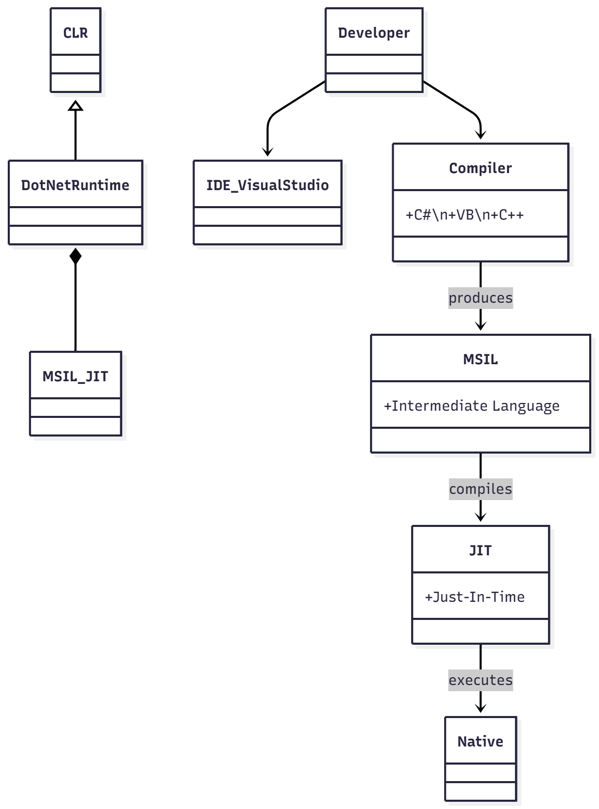
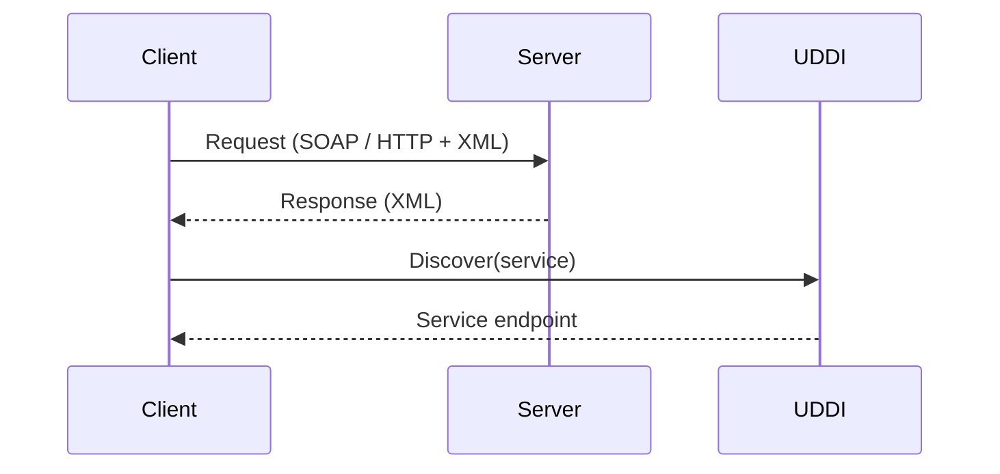
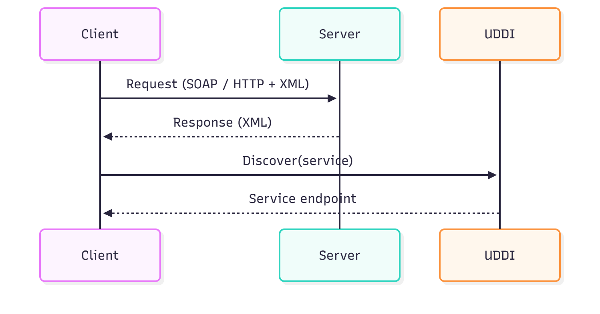

Plataforma .NET
===============

Laboratorio de Contenidos Digitales

Antonio Javier García Sánchez

Contenido
--------

- Introducción
- Elementos de la Plataforma .NET
- Servicios Web
- Arquitectura .NET
- Visual Studio .NET

Introducción
------------

Tres generaciones de Internet:

- Primera: Información y consulta.
- Segunda: Pago por la red, reservas, etc. Acciones realizadas de forma independiente.
- Tercera: B2B (Business-to-Business). Actividades coordinadas.

La Plataforma .NET es un conjunto de tecnologías, muchas ya existentes, que Microsoft integró para facilitar el desarrollo de servicios de tercera generación.

Pilares:

- Integración
- Nuevos dispositivos

Elementos de la plataforma:

- XML
- Servicios Web basados en XML
- Servidores para ejecutar servicios
- Software cliente para consumir servicios
- Herramientas de desarrollo

Servicios Web
------------

Un servicio web es un programa accesible a través de Internet usando protocolos estándar y se ejecuta en un servidor web. Para implementar un servicio web hay que resolver:

- Representación de datos
- Utilización del servicio
- Definición del servicio
- Publicación del servicio

Estándares principales:

- XML (Extensible Markup Language): define la estructura de la información intercambiada.
- SOAP (Simple Object Access Protocol): define cómo un cliente se comunica con un servicio.
- WSDL (Web Services Description Language): basado en XML; describe las operaciones de un servicio.
- UDDI (Universal Description, Discovery and Integration): permite publicar, localizar y usar servicios web.

Microsoft desarrolló también servicios orientados a usuario (.NET My Services).

Arquitectura .NET
-----------------

La arquitectura .NET es el modelo de programación de la plataforma para construir y ejecutar servicios. El objetivo es reducir la complejidad, permitiendo al desarrollador centrarse en la lógica del servicio. Está compuesta por librerías y un ejecutivo común (CLR).

Componentes destacados:

- Clases básicas
- Clases XML y de datos
- Web Forms / ASP.NET
- Windows Forms
- Ejecutivo del lenguaje común (CLR)

Lenguajes que targetean CLR: C#, VB, C++, entre otros.

Proceso de compilación y ejecución (resumen):

1. Código fuente (C#, VB, C++)
2. Compiladores producen código MSIL (Microsoft Intermediate Language)
3. El cargador, junto con el compilador JIT y el verificador, generan código nativo
4. El CLR ejecuta el código nativo

Proyecto Mono
------------

MONO es un proyecto para portar CLR a Linux (código abierto) y disponer de compiladores/implementaciones en distintos entornos.

Visual Studio .NET
------------------

Entorno de desarrollo integrado (IDE) lanzado por Microsoft. Facilita el desarrollo de aplicaciones Windows y servicios web, permitiendo elegir el lenguaje más adecuado.

Características heredadas:

- Edición de código
- Compilación
- Depuración integrada
- Gestión de proyectos

Mejoras en Visual Studio .NET:

- Ejecutivo común
- Clases unificadas
- Integración multilenguaje
- Soporte para ASP.NET y ADO.NET
- Plataforma abierta

C#: Conceptualmente parecido a Java, manteniendo la potencia de C++.

Conclusiones
-----------

- Cambio en la forma de desarrollar y utilizar aplicaciones en red.
- Nueva arquitectura Microsoft: tecnologías, estándares y herramientas (Visual Studio).
- Implica cambios en aplicaciones existentes; hay comparativas y alternativas (C# vs Java, etc.).

Diagramas sugeridos
-------------------

Arquitectura simplificada .NET (Mermaid class diagram):

```mermaid
classDiagram
    CLR <|-- ".NET Runtime"
    ".NET Runtime" *-- "MSIL/JIT"
    Developer --> "IDE (Visual Studio)"
    Developer --> "Compiler"
    Compiler --> MSIL: produces
    MSIL --> JIT: compiles
    JIT --> Native: executes
    class Compiler{+C#\n+VB\n+C++}
    class MSIL{+Intermediate Language}
    class JIT{+Just-In-Time}
```


Flujo básico de consumo de un Servicio Web (Mermaid sequence diagram):


