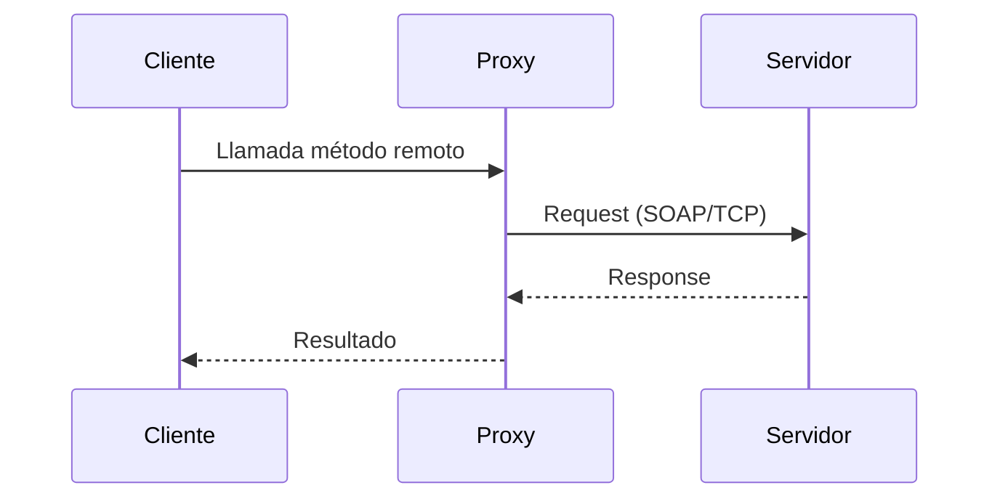
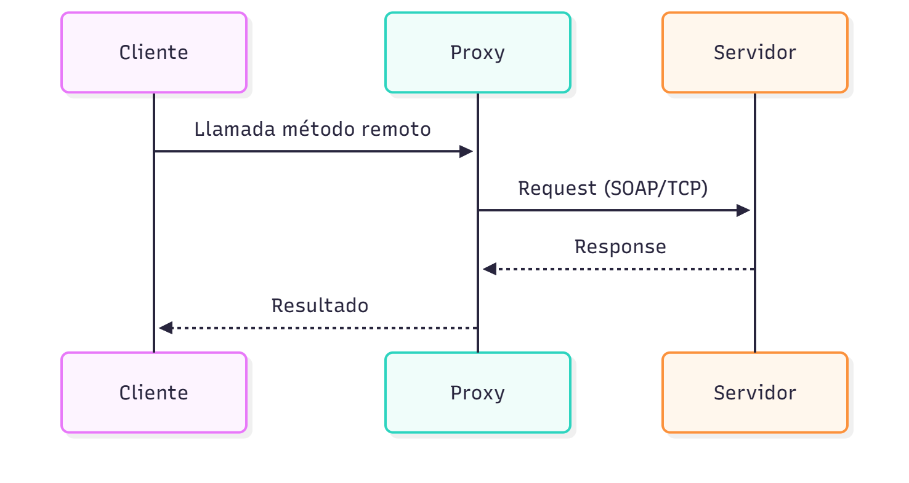
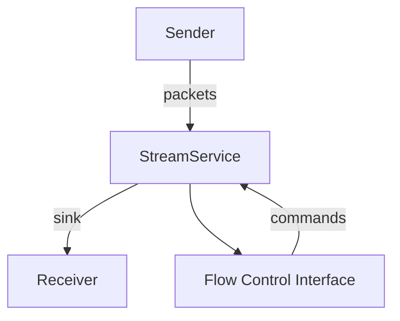
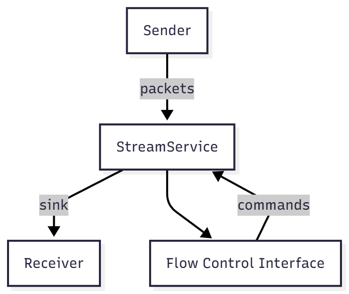

.NET Remoting
=============

Referencias principales
----------------------

1) David Conger, Remoting with C# and .NET. Wiley, 2003. ISBN: 047127352X
2) Ingo Rammer, Advanced .NET Remoting. Apress, 2002. ISBN: 1590590252

Antonio Javier García Sánchez

Contenido
---------

- Introducción
- Arquitectura de .NET Remoting
- Primer ejemplo (servidor/cliente)
- Uso de ficheros de configuración
- Canales (HTTP / TCP)
- Leasing y gestión de vida (lifetime)
- Objetos por valor y por referencia
- Aplicación versionada y strong names
- Ejemplo A/V Streaming (nota)

Introducción
------------

.NET Remoting permite comunicar aplicaciones distribuidas en .NET mediante la exposición de objetos remotos que pueden ser invocados por clientes remotos. La plataforma ofrece varias opciones de configuración que determinan cómo se comunicará el cliente con el servidor.

Áreas de configuración importantes:

- Selección del canal (HTTP o TCP)
- Tipo de aplicación host (consola, servicio de Windows, Windows Forms)
- Modo de activación (SingleCall, Singleton, Client Activated Objects - CAO)
- Método de configuración (programática o archivo de configuración)
- Exposición de tipos, URIs y ensamblados

Canales
-------

- HTTP: usa SOAP y es fácil de depurar con herramientas HTTP; puede ser lento.
- TCP: formato binario, más rápido pero no accesible desde un navegador para inspección SOAP.

Arquitectura simplificada
-------------------------

Conceptos clave:

- Host (aplicación servidor) que registra canales y tipos remotos.
- Cliente que obtiene un proxy local y llama métodos sobre él.
- Remoting usa proxies y URIs para localizar objetos remotos.

Mermaid: diagrama de alto nivel de interacción cliente-servidor




Primer ejemplo: objeto remoto (servidor)
-------------------------------------

Ejemplo simple de clase remota (paso por referencia):

```csharp
using System;
public class CompanyLists : MarshalByRefObject
{
    private string[] Countries = { "Spain", "France", "Italy" };

    public string[] GetCountryList()
    {
        return Countries;
    }
}
```

Host (registro programático usando HTTP channel):

```csharp
using System;
using System.Runtime.Remoting;
using System.Runtime.Remoting.Channels;
using System.Runtime.Remoting.Channels.Http;

class ListHost
{
    static void Main()
    {
        HttpChannel channel = new HttpChannel(8000);
        ChannelServices.RegisterChannel(channel);
        RemotingConfiguration.RegisterWellKnownServiceType(
            typeof(CompanyLists),
            "CompanyLists",
            WellKnownObjectMode.Singleton);
        Console.WriteLine("ListHost running on http://localhost:8000/CompanyLists");
        Console.ReadLine();
    }
}
```

Cliente (obtener proxy y usar):

```csharp
using System;
using System.Runtime.Remoting;

class ListClient
{
    static void Main()
    {
        CompanyLists cLst = (CompanyLists)Activator.GetObject(
            typeof(CompanyLists),
            "http://localhost:8000/CompanyLists");

        foreach (var c in cLst.GetCountryList())
            Console.WriteLine(c);
    }
}
```

Notas importantes
-----------------

- `MarshalByRefObject` indica que los objetos se pasan por referencia (se usa proxy).
- `WellKnownObjectMode.Singleton` mantiene una única instancia para todos los clientes.
- El servidor es multihilo para atender peticiones concurrentes.

Registro y manejo de errores (esquema simple)

```csharp
// Esquema de manejo de arranque y logs del host (simplificado)
try {
    // Registrar canal y servicios
}
catch (Exception ex) {
    // Registrar en EventLog o consola
}
```

Ficheros de configuración (XML)
------------------------------

Es habitual mantener la configuración de remoting en un archivo XML en lugar de hacerlo en código.

Ejemplo simplificado `ListHost.exe.config`:

```xml
<configuration>
  <system.runtime.remoting>
    <application name="ListServer">
      <service>
        <wellknown mode="Singleton" type="ListServer.CompanyLists,ListServer" objectUri="CompanyLists" />
      </service>
      <channels>
        <channel ref="http" port="8080" />
      </channels>
    </application>
  </system.runtime.remoting>
</configuration>
```

Y el `ListClient.exe.config` apuntaría a la URL correspondiente del servidor.

Uso de canales TCP
------------------

Cambiar HTTP por TCP suele mejorar el rendimiento porque usa formato binario, pero se pierde la facilidad de inspección por navegador.

Leasing y gestión de vida (lifetime)
----------------------------------

.NET Remoting por defecto no mantiene un contador de referencias remotas; el mecanismo de leasing controla la vida de objetos remotos para evitar retener recursos indefinidamente.

Ejemplo de inicialización de lifetime en el objeto remoto:

```csharp
using System;
using System.Runtime.Remoting.Lifetime;

public class Count : MarshalByRefObject
{
    public override object InitializeLifetimeService()
    {
        ILease lease = (ILease)base.InitializeLifetimeService();
        if (lease.CurrentState == LeaseState.Initial)
        {
            lease.InitialLeaseTime = TimeSpan.FromSeconds(5);
            lease.RenewOnCallTime = TimeSpan.FromSeconds(1);
            lease.SponsorshipTimeout = TimeSpan.FromSeconds(5);
        }
        return lease;
    }
}
```

Clientes pueden registrar un `ClientSponsor` para renovar leases desde el cliente.

Client Activated Objects (CAO)
-----------------------------

Los CAO permiten que el cliente cree instancias remotas para su uso exclusivo; se configuran con etiquetas `<activated>` en la configuración del servidor y cliente.

Paso de objetos por valor y por referencia
----------------------------------------

- Por valor: marcar la clase con `[Serializable]` para que los objetos se serialicen y se envíen como copia.
- Por referencia: heredar de `MarshalByRefObject` y trabajar con proxies.

Versionado y strong names
-------------------------

Para permitir múltiples versiones de un mismo componente en un host, .NET Remoting usa assemblies con strong names y se instalan en el GAC (Global Assembly Cache). El `assembly` en la configuración remoting puede incluir la versión y el `PublicKeyToken`.

Ejemplo de entry `wellknown` con versión y token (fragmento):

```xml
<wellknown mode="SingleCall" type="VersionServer.Test,VersionServer,Version=7.0.0.0,Culture=neutral,PublicKeyToken=7f38c07cea22d30a" objectUri="VersionServer2" />
```

A/V Streaming y .NET Remoting (nota)
-----------------------------------

Las aplicaciones multimedia suelen requerir tiempo real y gran ancho de banda. .NET Remoting añade overhead de CPU y red; para streaming es preferible diseñar servicios específicos (A/V Streaming Service) con adaptadores de flujo y control de flujo.

Mermaid: flujo simplificado A/V streaming




Conclusiones
------------

- .NET Remoting facilita la construcción de aplicaciones distribuidas en .NET, pero requiere cuidado en la configuración (canales, activación, lifetime).
- Para escenarios de alto rendimiento (multimedia) hay que combinar técnicas específicas de streaming y control de flujo.
- Versionado mediante strong names y GAC permite múltiples versiones cohabitando en el mismo host.
