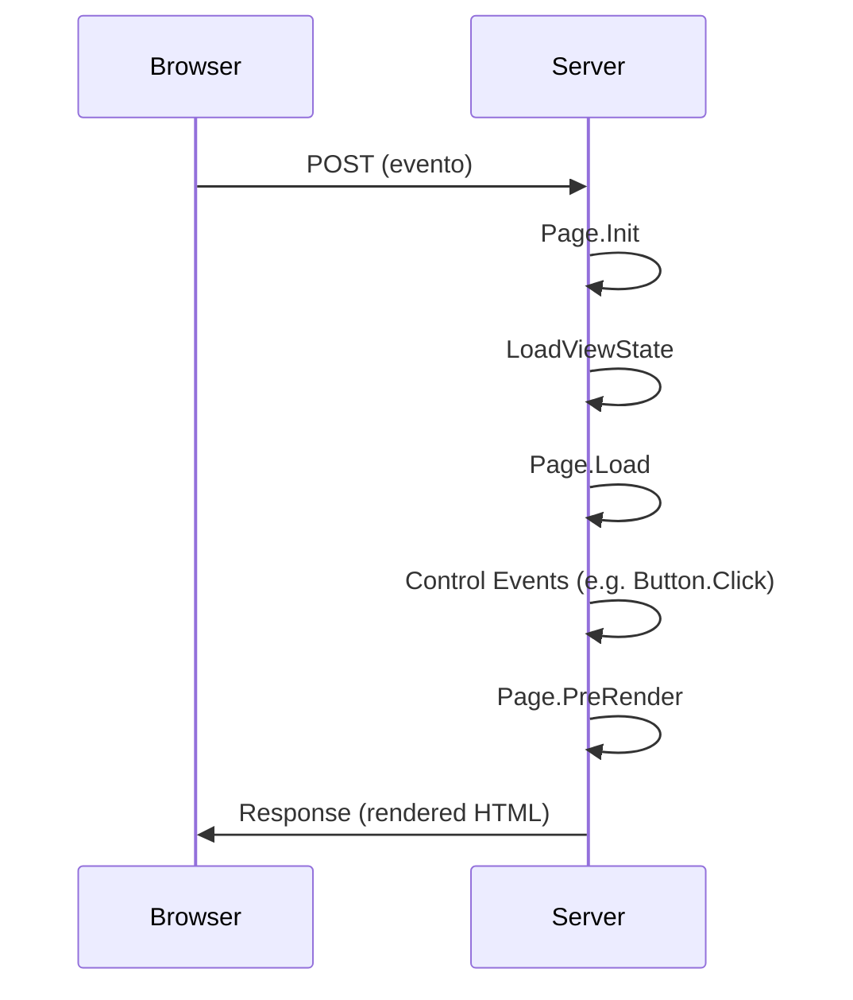
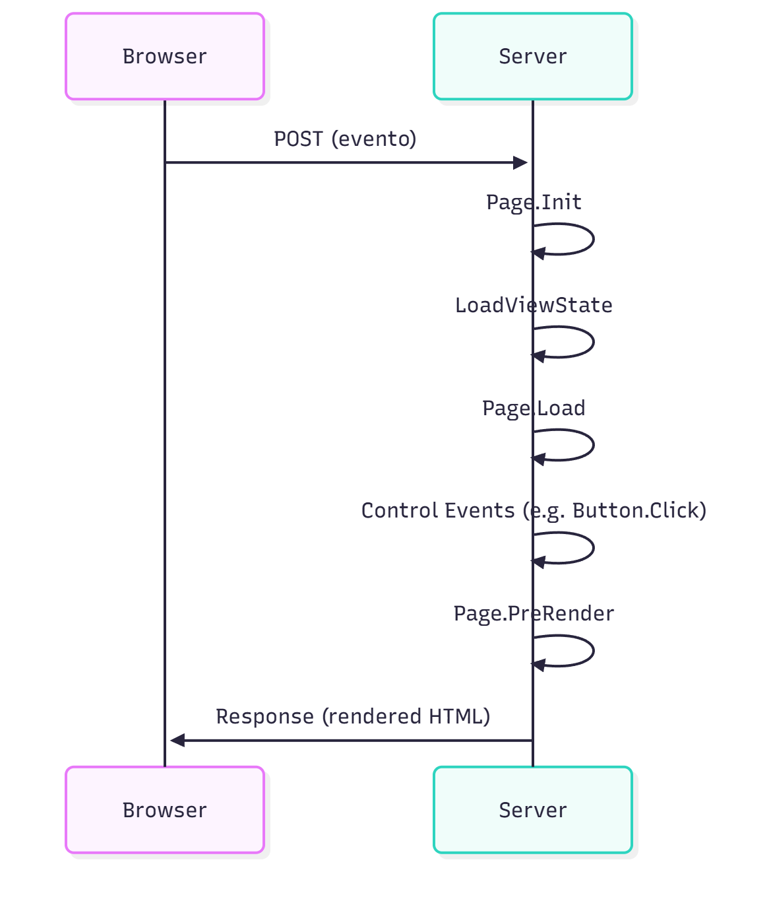
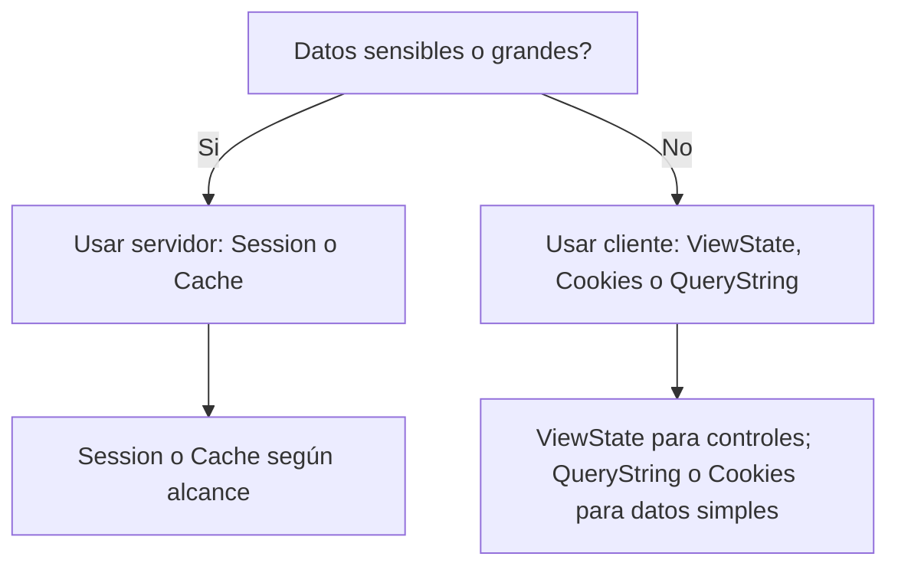
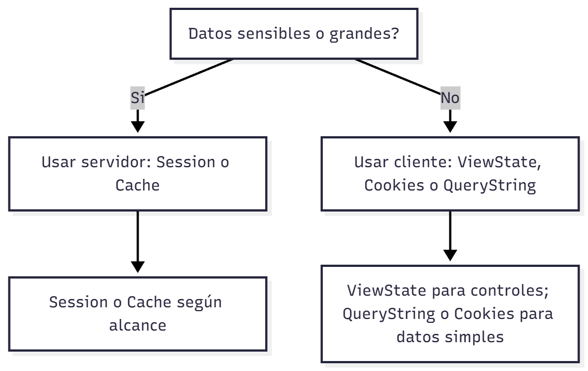

ASP.NET
======

Referencias
----------

- La Biblia ASP.NET. Ed. Anaya. ISBN: 84-415-1385-6
- Desarrollo Profesional de Aplicaciones Web con ASP.NET. ISBN: 84-609-4245-7

Antonio Javier García Sánchez

Contenido
---------

- Introducción
- Componentes de un servicio ASP.NET
- WebForms y Code-Behind
- Controles de servidor (HtmlControls y WebControls)
- Eventos y PostBack
- Ciclo de vida de la página
- Autenticación (IIS, Formularios, URL)
- Gestión de estados (cliente y servidor)
- Resumen y capacidades adquiridas

Introducción
------------

Una aplicación web es un conjunto de páginas que el servidor envía al cliente mediante HTTP. IIS (Internet Information Services) es el servidor web de Microsoft que proporciona servicios como HTTP/HTTPS, FTP, SMTP.

ASP.NET es el framework de Microsoft para programar aplicaciones web dentro de .NET. Su componente principal son los WebForms (.aspx) que permiten separar la interfaz de usuario (markup) de la lógica (code-behind).

Ventajas de ASP.NET:

- Páginas compiladas (mejor rendimiento y errores en compilación)
- Actualización de aplicaciones sin reiniciar el servidor
- Acceso a la .NET Class Library
- Indepedencia de lenguaje: puede usar C#, VB.NET, etc.
- Controles de servidor reutilizables y encapsulados
- Soporte para ADO.NET y XML

Componentes de un servicio ASP.NET
---------------------------------

- WebForms: archivos .aspx que representan páginas.
- Code-Behind: archivos que contienen la lógica del lado servidor (por ejemplo .aspx.cs).
- Archivos de configuración: Web.config por aplicación y Machine.config por servidor.
- Directorio BIN: contiene los assemblies de la aplicación (por ejemplo MiAplic.dll).

WebForms - generalidades
-----------------------

Un WebForm es una página marcup compilada en el servidor para generar la salida al cliente. El patrón Partial Class se usa para vincular markup (ASPX) con code-behind.

Controles de servidor
---------------------

ASP.NET dispone de dos familias de controles en servidor:

- HtmlControls: mapean directamente a elementos HTML marcados con runat="server".
- WebControls: proporcionan un modelo de programación más consistente y de alto nivel (TextBox, Button, GridView, etc.).

Los controles de servidor mantienen estado entre postbacks mediante ViewState y pueden renderizar HTML distinto según el navegador.

Ejemplo simple (markup con HtmlControls):

```asp
<%@ Page Language="C#" %>
<html>
  <body>
    <form runat="server">
      <input type="radio" runat="server" />click me<br/>
      <input type="checkbox" runat="server" />check me<br/>
      <input type="text" value="type in me" runat="server" /><br/>
      <textarea runat="server">type more in me</textarea><br/>
      <table runat="server">
        <tr><td>cell00</td><td>cell01</td></tr>
        <tr><td>cell10</td><td>cell11</td></tr>
      </table>
    </form>
  </body>
</html>
```

Eventos en un WebForm
---------------------

Cuando se trabaja con controles de servidor se producen eventos en el servidor (postbacks). Cada evento relevante en la página genera un POST hacia el servidor y una respuesta. ViewState transporta el estado de los controles entre postbacks.

Ejemplo de declaración y manejo de evento (WebControl):

```asp
<asp:Button ID="btnEjemplo" runat="server" Text="Aceptar" OnClick="btnEjemploClick" />
```

```csharp
protected void btnEjemploClick(object sender, EventArgs e)
{
    if (!string.IsNullOrEmpty(txtEjemplo.Text))
        lblEjemplo.Text = txtEjemplo.Text;
}
```

Ciclo de vida de la página
-------------------------

El ciclo de vida de una página ASP.NET incluye eventos como Init, Load, PreRender y Unload. El orden de ejecución es importante para inicializar datos, restaurar ViewState y realizar acciones antes de renderizar.

Diagrama (flujo simplificado de un PostBack):




Autenticación
--------------

La autenticación es el mecanismo para verificar la identidad del usuario. ASP.NET soporta varios modelos:

- Basada en Windows (IIS maneja la autenticación)
- Basada en Formularios (Forms Authentication): redirección a una página de login y uso de cookies de autenticación
- Basada en URL (autorización por rutas/recursos)

Ejemplo simplificado (Web.config) para Forms Authentication:

```xml
<configuration>
  <system.web>
    <authentication mode="Forms">
      <forms loginUrl="/Account/Login.aspx" timeout="30" />
    </authentication>
  </system.web>
</configuration>
```

Gestión de estados (State Management)
------------------------------------

Técnicas para persistir información entre páginas:

Lado cliente (mejor rendimiento, menor seguridad):

- Query strings (ej. ?id=123)
- Campos ocultos (HtmlInputHidden)
- ViewState: almacena el estado de propiedades de controles en el cliente (indexado, opcionalmente cifrado/comprimido)
- Cookies (HttpCookie)

Lado servidor (mayor seguridad y capacidad):

- Session (objeto Session por usuario)
- Application (datos globales de la aplicación)
- Cache (gestión avanzada con expiración y políticas)

Mermaid: flujo de decisión para elegir técnica de estado




Resumen y capacidades adquiridas
--------------------------------

- ASP.NET es la evolución del clásico ASP: páginas compiladas y modelos de control más robustos.
- WebControls y HtmlControls permiten mapear la interfaz HTML a objetos servidor.
- El ciclo de vida de la página y el manejo de eventos (postbacks) son esenciales para diseñar aplicaciones eficientes.
- La elección de la técnica de gestión de estado depende de requisitos de seguridad, volumen y rendimiento.