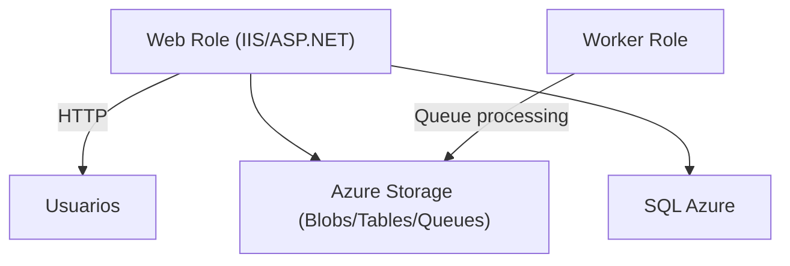
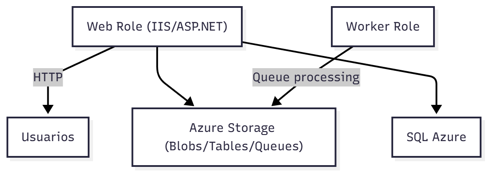
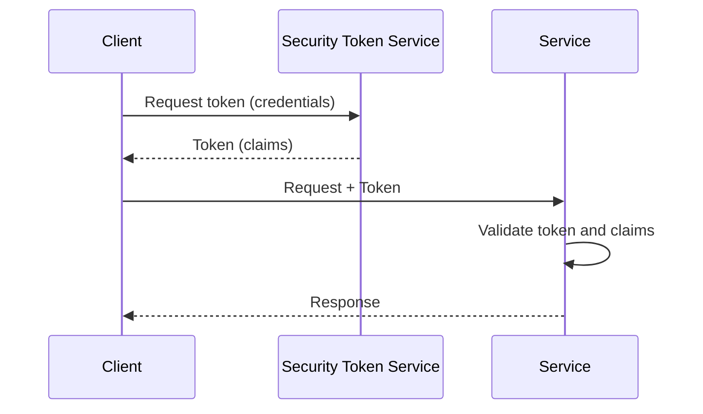
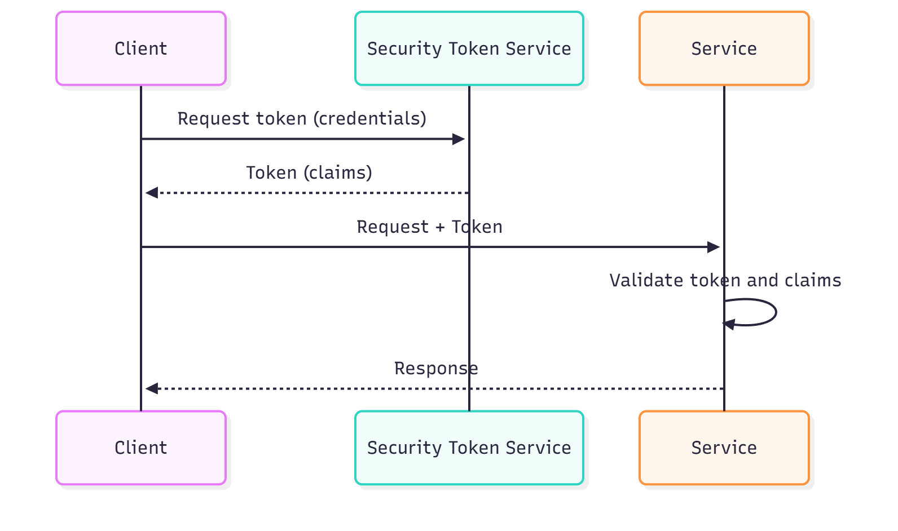
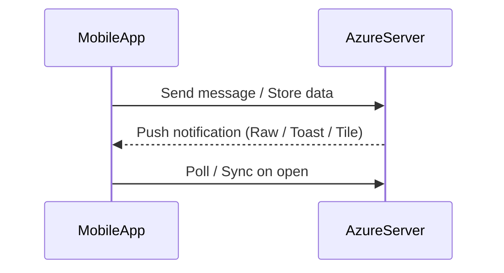
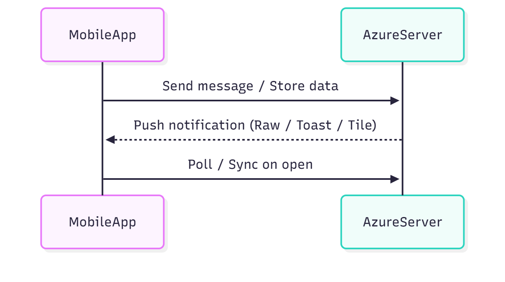

Servicios Cloud — Windows Azure
================================

Antonio Javier García Sánchez

Contenido
---------

- Introducción y patrones Cloud
- Qué ahorra y qué ofrece el Cloud
- Modelos PaaS y Windows Azure Platform
- Windows Azure: roles y arquitectura
- SQL Azure: características y seguridad
- Almacenamiento no relacional (Blobs, Tables, Queues)
- AppFabric (Service Bus, Access Control)
- Windows Identity Foundation (WIF) y claims
- Integración con dispositivos móviles (OneDrive, Windows Phone)

Introducción
------------

Patrones adaptados a la nube:

- Aplicaciones con picos predecibles
- Aplicaciones con picos impredecibles
- Aplicaciones de crecimiento rápido
- Aplicaciones On-Off

Qué aporta el Cloud (ahorro):

- Gestión del sistema operativo de base
- Configuración y gestión de servicios base (S.O., DB, app servers)
- Actualizaciones y parches de infraestructura
- Diagnóstico y respuesta ante fallos de hardware
- Almacenamiento con alta disponibilidad
- Monitorización, balanceo de carga y respuesta a picos de tráfico

Qué ofrece el Cloud:

- Auto-servicio para clientes
- Medición del servicio
- Pago por uso
- Elasticidad rápida
- Distribución geográfica

PaaS (Plataforma como Servicio)
-------------------------------

PaaS permite desarrollar y desplegar aplicaciones en la nube sin preocuparse por la infraestructura. La desventaja puede ser el vendor lock-in (APIs propias de cada plataforma).

Windows Azure Platform
-----------------------

Windows Azure Platform es la oferta PaaS de Microsoft. Componentes principales:

- Windows Azure (computación y roles)
- SQL Azure (bases de datos relacionales)
- Windows Azure Storage (Blobs, Tables, Queues)
- Windows Azure AppFabric (Service Bus, Access Control, Cache)
- Marketplace

Objetivos:

- Reutilizar habilidades .NET existentes
- Desarrollar y desplegar con rapidez
- Administrar recursos sin complejidad adicional

Windows Azure: conceptos clave
------------------------------

- Web role: aplicación web (IIS/ASP.NET) accesible por HTTP(S).
- Worker role: proceso en segundo plano (similar a un servicio Windows) para tareas background, colas, procesamiento asíncrono.

Mermaid: arquitectura simplificada de roles

SQL Azure
---------

SQL Azure es una base de datos relacional en la nube basada en SQL Server. Soporta tablas, vistas, índices, procedimientos almacenados y transacciones (no distribuidas). Ofrece alta disponibilidad y facilita migraciones desde entornos on-premises.

Seguridad y aprovisionamiento:

- Logins a nivel servidor y usuarios/roles a nivel de base de datos
- Aislamiento lógico por cuenta/servidor
- Gestión de versiones y escalabilidad (federation en escenarios específicos)

Almacenamiento no relacional (Azure Storage)
------------------------------------------

Servicios:

- Blob Service: almacenamiento de ficheros y objetos binarios
- Table Service: almacenamiento NoSQL de entidades (clave/atributo)
- Queue Service: mensajería simple para desacoplar componentes
- Windows Azure Drive: montar almacenamiento como disco NTFS

Todos los servicios son accesibles vía REST y pueden utilizarse desde cualquier lenguaje capaz de realizar peticiones HTTP.

AppFabric
---------

AppFabric incluye Service Bus (relay y brokered messaging), Access Control (servicio de autorización federada) y AppFabric Cache.

Service Bus

- Permite comunicar servicios a través de firewalls mediante relays y colas.
- Modelos: relay (reenvío) y brokered messaging (colas/pub-sub).

Seguridad en Service Bus

- Uso de AppFabric Access Control para autenticar y autorizar extremos.
- Métodos de autenticación: SharedSecret, SAML, y otros mecanismos.

Access Control y Windows Identity Foundation (WIF)
-------------------------------------------------

Access Control permite generar autorizaciones federadas; WIF provee un modelo basado en claims y facilita integrar proveedores de identidad (AD, Live ID, Google, Facebook, etc.).

Funcionamiento general:

1. El cliente obtiene un token del Access Control Service (ACS) o STS (Security Token Service).
2. El token contiene un conjunto de claims (atributos) firmados.
3. El cliente presenta el token al servicio para autenticación y autorización.

Mermaid: flujo de token y claims

Windows Identity Foundation (WIF)

WIF facilita el uso de tokens y claims en aplicaciones .NET; usa protocolos como WS-Trust y WS-Federation y asegura los tokens mediante firmas (SAML).

OneDrive y dispositivos móviles
-------------------------------

OneDrive es una solución de almacenamiento integrada en Windows. Las aplicaciones móviles pueden sincronizar archivos con OneDrive y usar almacenamiento aislado en el dispositivo.

Windows Phone y desarrollo móvil con Azure

Elementos clave:

- Servidor Windows Azure con Mobile Services o servicios personalizados
- Soporte en dispositivo (almacenamiento aislado, sincronización)
- Silverlight/XAML o XNA para interfaces y juegos (en versiones antiguas)
- Emulador y Visual Studio para desarrollo

Flujo simplificado: cliente móvil ↔ Azure (mensajería y notificaciones)

Notificaciones y Push

- Cuando el receptor tiene la app cerrada, recibe Toast/Tile notifications.
- Si la app está abierta, puede recibir Raw notifications y reaccionar (consultar base de datos, actualizar UI).

Modelo de negocio y costes
-------------------------

El servicio Azure puede ser gratuito en limitadas condiciones; con más usuarios se incurre en costes. Modelos comunes: versión gratuita con publicidad y versión Pro con pago único o suscripción.

Conclusiones
-----------

- Azure ofrece una plataforma flexible para desplegar aplicaciones escalables.
- Debe considerarse seguridad, costes y la posible dependencia del proveedor.
- Para móviles, Azure facilita notificaciones y sincronización; para multimedia/streaming puede requerir servicios específicos.