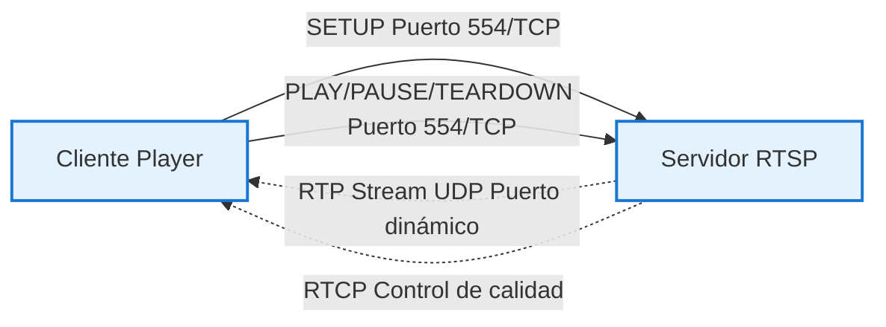
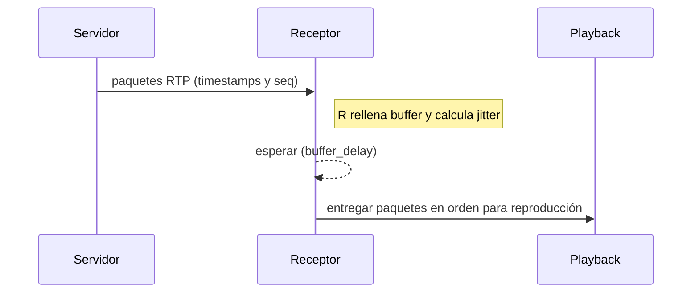

# Unidad Didáctica 1 — Introducción a Streaming Multimedia (A/V)

Fecha: 12/03/2014

## Objetivos

- Conocer y entender los aspectos fundamentales de la generación y transmisión de servicios de streaming.
- Entender el concepto de compresión en servicios de streaming y sus efectos sobre calidad y ancho de banda.
- Conocer requisitos y capacidades de diseño específicas de servicios multimedia en redes IP (latencia, jitter, pérdidas, QoS).

## Competencias adquiridas

- Identificar las partes y el funcionamiento básico de aplicaciones multimedia sobre IP.
- Comprender protocolos clave (RTSP, RTP, RTCP) y modelos de transmisión (unicast, multicast, client-server).
- Aplicar técnicas para mitigar problemas de la red: buffering, FEC, interleaving y control adaptativo de tasa.

---

## Índice

1. Aplicaciones multimedia en redes IP
2. Modelos de transmisión y opciones de reproducción
3. RTSP — control de sesiones multimedia
4. RTP / RTCP — transporte y control de tiempo real
5. Problemas de IP: pérdidas, retardo y jitter
6. Técnicas de recuperación y suavizado: buffering, FEC, interleaving
7. Preguntas de clase / ejercicios

---

## 1. Aplicaciones multimedia en redes IP

Clasificación típica de aplicaciones multimedia:

- Streaming de audio/video almacenado (on-demand).
- Streaming "uno-a-muchos" de A/V en tiempo real (broadcast, multicast).
- A/V interactivo en tiempo real (videoconferencia, VoIP).

Cada tipo tiene requisitos distintos en cuanto a latencia, fiabilidad y ancho de banda; por ejemplo, VoIP requiere baja latencia mientras que una descarga bajo demanda prioriza integridad de los datos.

---

## 2. Modelos de transmisión y opciones de reproducción

Opciones para entregar y reproducir A/V almacenado:

1. Envío por UDP a tasa constante (emisor genera y receptor reproduce a la misma tasa). Útil cuando retrasos pequeños y pérdida baja.
2. Envío por UDP con buffer inicial (retardo entre 2–5 s) para absorber jitter y pérdidas puntuales.
3. Envío por TCP con reproducción diferida (buffer de 2–5 s). TCP corrige pérdidas por retransmisión pero introduce fluctuaciones por control de congestión.
4. TCP con buffer amplio (pre-carga) para permitir utilización variable de ancho de banda y minimizar pausas.

Ventaja/desventaja resumida:

- UDP: menor latencia, pero sin retransmisión; requiere mecanismos en el receptor para tolerar pérdidas.
- TCP: garantiza entrega, pero puede introducir latencia variable y pausas cuando hay congestión.

---

## 3. RTSP — Protocolo de control de sesiones (RFC 2326)

RTSP (Real Time Streaming Protocol) es un protocolo de control que permite a un reproductor multimedia controlar la reproducción de un flujo (pausar, reanudar, posicionar, etc.). Es un protocolo "fuera de banda": los mensajes RTSP viajan separados del flujo de datos multimedia.

Puntos clave:

- RTSP no define códecs ni la encapsulación exacta de los paquetes A/V. Normalmente se usa RTP para transportar paquetes, pero RTSP solo controla la sesión.
- No impone un protocolo de transporte: control y datos pueden pasar por TCP o UDP según la implementación.
- Puerto por defecto: 554 (aunque puede variarse).

Métodos RTSP (ejemplos):

- OPTIONS, DESCRIBE, SETUP, PLAY, PAUSE, TEARDOWN, ANNOUNCE, RECORD, REDIRECT, SET_PARAMETER.

### Ejemplo de secuencia (simplificada)

```mermaid
sequenceDiagram
    participant C as Cliente
    participant S as Servidor RTSP
    
    Note over C,S: Fase SETUP - Negociación
    C->>S: SETUP rtsp://audio.example.com/twister/audio RTSP/1.0
    Note right of C: Transport: RTP/UDP;port=3056;mode=PLAY
    S->>C: RTSP/1.0 200 OK
    Note left of S: Session: 4231
    
    Note over C,S: Fase PLAY - Inicio streaming
    C->>S: PLAY rtsp://audio.example.com/twister/audio RTSP/1.0
    Note right of C: Session: 4231
    S->>C: RTSP/1.0 200 OK
    Note over S: Streaming activo
    S-->>C: Flujo RTP al puerto 3056/UDP
    
    Note over C,S: Fase PAUSE
    C->>S: PAUSE rtsp://audio.example.com/twister/audio RTSP/1.0
    Note right of C: Session: 4231
    S->>C: RTSP/1.0 200 OK
    
    Note over C,S: Fase TEARDOWN - Fin
    C->>S: TEARDOWN rtsp://audio.example.com/twister/audio RTSP/1.0
    Note right of C: Session: 4231
    S->>C: RTSP/1.0 200 OK
```

### Diagrama: control RTSP (fuera de banda) y datos RTP (en banda)



---

## 4. RTP / RTCP — Transporte y control en tiempo real

### RTP (Real-time Transport Protocol)

- RTP define un formato de paquete para transportar datos multimedia (audio/video) en tiempo real.
- RTP no garantiza entrega ni control de congestión: esas funciones permanecen en capas inferiores o complementarias.
- Cada fuente multimedia se mapea a un flujo RTP independiente (SSRC identifica el flujo).
- RTP incluye número de secuencia y marca de tiempo (timestamp) que permiten reordenar paquetes, detectar pérdidas y sincronizar A/V.

Ejemplo (campos importantes de la cabecera RTP):

- Version (V)
- Padding (P)
- Extension (X)
- CSRC Count (CC)
- Marker (M)
- Payload Type (PT)
- Sequence Number
- Timestamp
- SSRC

### RTCP (RTP Control Protocol)

- RTCP trabaja junto a RTP para proporcionar información de control y estadísticas (calidad de recepción, pérdida, jitter, etc.).
- Los receptores envían informes de recepción que incluyen: SSRC, fracción de pérdida, último número de secuencia recibido y estimación de jitter.
- Los emisores envían sender reports con información de envío: SSRC, timestamp, cantidad de paquetes/bytes enviados.
- RTCP se usa para adaptar la tasa de codificación, detectar problemas y recopilar métricas.

#### Intervalos y algoritmo de temporización (resumen)

- RTCP calcula un intervalo T entre envíos de paquetes de control en función del número de flujos y parámetros mínimos (Tmin). Se utiliza:

  `T = max(Tmin, n * C)`

  donde n es número de participantes y C es factor relativo (por ejemplo número de canales). Posteriormente se aleatoriza entre 0.5T y 1.5T para evitar sincronización.

---

## 5. Problemas de IP: pérdidas, retardo y jitter

### Pérdida de paquetes

- Uso de TCP elimina pérdidas mediante retransmisión, pero las retransmisiones no son adecuadas para aplicaciones interactivos (añaden retardo).
- Para VoIP y aplicaciones en tiempo real se suele usar UDP y tolerar pérdidas parciales.
- Técnicas complementarias: FEC (Forward Error Correction) y ocultación de pérdidas en códecs.

### Retardo extremo a extremo

- El retardo total incluye: procesamiento en emisor/receptor, colas en routers, propagación y codificación/decodificación.
- Umbrales aproximados para voz:
  - <150 ms: imperceptible
  - 150–400 ms: aceptable con degradación
  - >400 ms: inaceptable, provoca conversaciones ininteligibles

### Jitter

- Variación aleatoria en el retardo por paquete debido a colas en routers.
- Se mitiga en el receptor mediante buffering y mecanismos basados en números de secuencia y timestamps.

---

## 6. Técnicas de recuperación y suavizado

### Buffering (reproducción retardada)

- Reproducción retardada fija: el receptor espera un tiempo fijo antes de empezar a reproducir.
- Reproducción retardada adaptativa: el receptor ajusta el retardo de reproducción según la variabilidad observada (jitter estimate).

Diagrama: buffering adaptativo (esquema)



### Forward Error Correction (FEC)

- Se envía información redundante que permite recuperar paquetes perdidos sin retransmisión.
- Ejemplo básico: por cada k bloques de datos se envía un bloque de paridad; con ello se puede recuperar pérdidas parciales.

### Interleaving

- Permite distribuir los bytes de una trama o bloque en varios paquetes para que pérdidas consecutivas afecten a diferentes partes de la trama original, facilitando la recuperación mediante FEC o técnicas de ocultación.

---

## 7. Ejercicios y cuestiones de clase

1. Diferencia entre RTSP y RTCP: describa las responsabilidades principales de cada protocolo y por qué ambos son necesarios en streaming.
2. Describa cómo implementar una conexión a contenido de audio en un servidor remoto usando RTSP (pasos y mensajes principales).
3. Explique cómo combinar RTP y RTCP para la transmisión y control de un flujo de audio/video.
4. Describa los campos principales de una cabecera RTP y su utilidad (por ejemplo, sequence number y timestamp).
5. Para los sistemas de distribución A/V vistos (unicast sobre TCP, UDP con buffer, multicast), qué sistema elegiría y por qué para:
   - 5.1 Un servidor de TV IP.
   - 5.2 Copia de seguridad de archivos A/V.
   - 5.3 Un servidor para servicios de telefonía IP.

---

## Bibliografía recomendada

- J. F. Kurose and K. W. Ross — Computer Networking: A Top-Down Approach. Addison-Wesley.
- O. Hersent, D. Gurle — IP Telephony: Packet-Based Multimedia Communications Systems. Addison-Wesley.
- R. Schaphorst — Videoconferencing and Videotelephony. Artech House.
- K. I. Park — QoS in Packet Networks. Springer.

---

*Archivo generado automáticamente a partir de `unit6.txt` y reestructurado para facilitar el aprendizaje.*