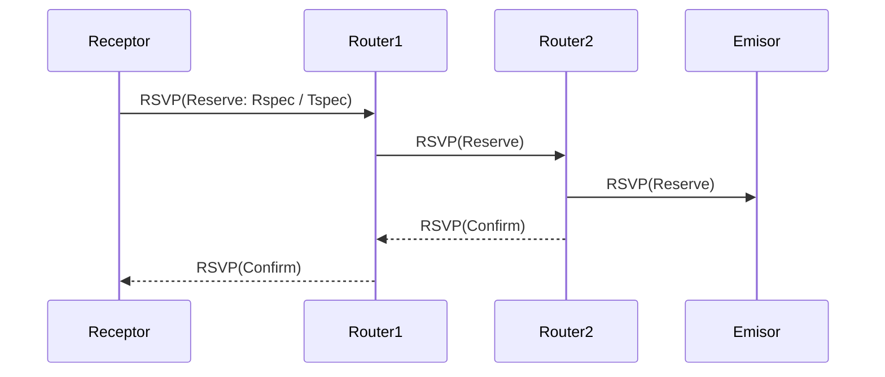

# Unidad Didáctica 1 — Mejorando el servicio "best-effort" (DiffServ / IntServ / RSVP)

Fecha: 12/11/2014

## Resumen y objetivos

En esta unidad se presenta cómo mejorar el comportamiento "best-effort" de Internet para soportar aplicaciones multimedia sensibles a la calidad (voz, vídeo, videoconferencia). Aprenderás:

- Por qué el servicio best-effort puede ser insuficiente para A/V en tiempo real.
- Dos arquitecturas para proporcionar garantías de QoS: IntServ (RSVP) y DiffServ.
- Mecanismos de control de tráfico: policers (Leaky Bucket), scheduling (FIFO, Priority, WFQ).
- Conceptos clave: admisión de llamadas, perfiles de tráfico (Tspec/Rspec), PHB y DSCP.

El objetivo educativo es que comprendas las decisiones de diseño y cómo se implementan (o configuran) en la red.

---

## 1. Problema: "best-effort" no garantiza QoS

Internet trata todos los paquetes de forma igual (best-effort). Esto es suficiente para muchas aplicaciones, pero no para A/V en tiempo real:

- La congestión aumenta la latencia y la variabilidad (jitter).
- Pérdidas de paquetes afectan la inteligibilidad de audio/video.
- TCP puede ocultar pérdidas mediante retransmisiones, pero introduce latencia y variaciones en la tasa que perjudican la reproducción en tiempo real.

Por tanto, necesitamos mecanismos para priorizar tráfico, aislar flujos y, cuando sea necesario, reservar recursos extremo a extremo.

---

## 2. Principios de diseño para ofrecer QoS (resumen)

1. Clasificar paquetes en clases de tráfico para tratarlos de forma distinta.
2. Proporcionar aislamiento entre flujos (evitar que un flujo "mal comportado" colapse otros).
3. Usar los recursos de forma eficiente (no reservar de forma excesiva).
4. Admisión de llamadas: aceptar o rechazar una nueva sesión según disponibilidad de recursos.

---

## 3. Scheduling: cómo un router decide qué paquete sacar primero

Tabla comparativa (conceptual):

| Algoritmo | Comportamiento | Ventaja | Inconveniente |
|---|---:|---|---|
| FIFO | Primera llegada, primera salida | Sencillo | No prioriza tráfico sensible al retraso |
| Priority Queuing | Colas por prioridad, se atiende cola alta primero | Prioriza audio/video | Puede provocar inanición de colas bajas |
| WFQ / Round Robin ponderado | Reparto justo ponderado del ancho de banda entre flujos/clases | Justicia entre flujos, evita inanición | Más complejo (necesita clasificación y pesos)

Diagrama conceptual:

```mermaid
flowchart LR
  subgraph Router
    direction TB
    A[Incoming packets]
    C1[Priority Queue]
    C2[WFQ Queue A]
    C3[WFQ Queue B]
    S[Scheduler]
    O[Outgoing Link]
  end
  A -->|classify| C1
  A -->|classify| C2
  A -->|classify| C3
  C1 --> S
  C2 --> S
  C3 --> S
  S --> O
  note right of S: Scheduler puede aplicar FIFO, Priority o WFQ
```

### Ejemplo breve
Si audio y FTP comparten un enlace de 1.5 Mbps, Priority puede dar prioridad estricta al audio (1.0 Mbps) y dejar FTP usar el resto cuando no hay audio. Si varios flujos de audio compiten con la misma prioridad, necesitamos aislamiento (p.ej. WFQ o control de admisión) para evitar que saturen el enlace.

---

## 4. Policing: controlar cuánto tráfico puede inyectar un emisor (Leaky Bucket)

El policing limita la tasa y la ráfaga de un flujo. Un modelo común es **Leaky Bucket** (o token bucket en formulaciones equivalentes).

- Parámetros: tasa sostenida `r` (tokens/segundo) y ráfaga máxima `b` (tokens acumulables).
- Regla: en cualquier intervalo de tiempo `t` la cantidad máxima de bits permitidos es `r * t + b`.

Interpretación práctica:

- Si envías dentro del perfil (`r`, `b`), los paquetes se marcarán como conformes y recibirán tratamiento preferente.
- Si excedes el perfil, los paquetes pueden ser reetiquetados con menor prioridad o descartados.

Diagrama simple (mermaid):

```mermaid
flowchart LR
  A[Emisor] --> B[Policer (Leaky Bucket)]
  B -->|conforme| C[Marked as high priority]
  B -->|exceso| D[Marked as low priority / Drop]
  C --> E[Network Edge]
  D --> E
```

Fórmula útil: si `R` es la tasa servida (capacidad del enlace), el retardo máximo en cola para tráfico de ráfaga `b` queda acotado por `b / R`.

---

## 5. IntServ (Integrated Services) y RSVP — reserva por flujo

IntServ pretende dar garantías extremo a extremo reservando recursos en cada router del path. RSVP es el protocolo de señalización típico.

Pasos (simplificados) para reservar una sesión con RSVP:

1. El emisor y/o receptor definen Tspec (caracterización del tráfico) y Rspec (requisitos de QoS).
2. El receptor envía mensajes RSVP a lo largo del árbol multicast (o camino unicast) solicitando la reserva.
3. Cada router en la ruta evalúa si puede admitir la reserva (admisión de llamadas) y, si es así, reserva recursos locales (ancho de banda y buffers).
4. Si un router no puede admitir la reserva, la petición es rechazada y el receptor puede solicitar una calidad menor o abortar.

Diagrama de señalización (simplificado):



### Ventajas y limitaciones

- Ventaja: reservas precisas y controladas, posibilidad de garantizar retardos y pérdidas.
- Limitación: **escalabilidad** — mantener estado por flujo en routers no escala bien en Internet a gran volumen.

---

## 6. DiffServ (Servicios diferenciados)

DiffServ propone marcar paquetes en el borde (edge) y aplicar un comportamiento por salto (PHB) en el núcleo (core). En vez de reservar por flujo, DiffServ agrupa el tráfico en clases tratadas de forma agregada.

Componentes:

- **Borde (edge)**: clasifica y acondiciona (marking, policing, shaping) paquetes según el perfil negociado; añade valores DSCP en la cabecera IP.
- **Núcleo (core)**: reenvía paquetes según el PHB (Per-Hop Behavior) definido para cada DSCP; no necesita mantener estado por flujo.

Diagrama borde-núcleo:

```mermaid
flowchart LR
  subgraph Edge
    H[Host / Sender]
    E[Edge Router]
  end
  subgraph Core
    C1[Core Router 1]
    C2[Core Router 2]
  end
  H --> E
  E --> C1 --> C2 --> Dest[Receiver]
  note left of E: Clasificación, policing, marcado DSCP
  note right of C1: PHB aplicado según DSCP
```

### DSCP y PHB

- DSCP: campo de 6 bits en la cabecera IPv4/IPv6 que indica el comportamiento por salto.
- PHB: describe externamente el comportamiento esperado (p.ej. baja latencia, alta prioridad), pero no impone un mecanismo de implementación.

Ejemplo operativo:

- Un usuario se registra con un perfil que define `r` y `b`. Mientras cumpla, sus paquetes se marcarán con DSCP `<<AF41>>` (ejemplo) y recibirán baja latencia. Si el usuario excede el perfil, la función de medición en el borde marcará los paquetes como menor prioridad.

---

## 7. Comparativa IntServ vs DiffServ

- **IntServ (RSVP)**: reservas por flujo, garantías estrictas, buena para entornos controlados (LAN, campus), pobre escalabilidad en core.
- **DiffServ**: clasificación y marcado en los bordes, escalable en núcleo, proporciona clases de servicio agregadas (no reservas por flujo estrictas).

Recomendación práctica: usar DiffServ para escalabilidad en la red troncal e IntServ/RSVP en dominios controlados cuando se requieran reservas estrictas.

---

## 8. Ejercicios y preguntas (didácticas)

1. Compare FIFO, Priority y WFQ desde la perspectiva de latencia para flujos de voz.
2. Dados `r = 1 Mbps` y `b = 50 KB`, calcule la máxima cantidad de datos que se pueden enviar en 2 segundos.
3. Diseñe un sencillo esquema DiffServ (tres clases: alta, normal, baja) y describa qué PHB aplicaría a cada una.
4. Explique por qué RSVP no escala bien en Internet y proponga escenarios donde sí tiene sentido usarlo.

---

## 9. Recursos y bibliografía

- RFC 2475 — An Architecture for Differentiated Services
- RFC 2205 — Resource ReSerVation Protocol (RSVP)
- J. F. Kurose, K. W. Ross — Computer Networking: A Top-Down Approach

---

*Archivo generado a partir de `unit7.txt` y reestructurado para un uso docente: contenido sin emoticonos, con diagramas mermaid y ejemplos prácticos.*