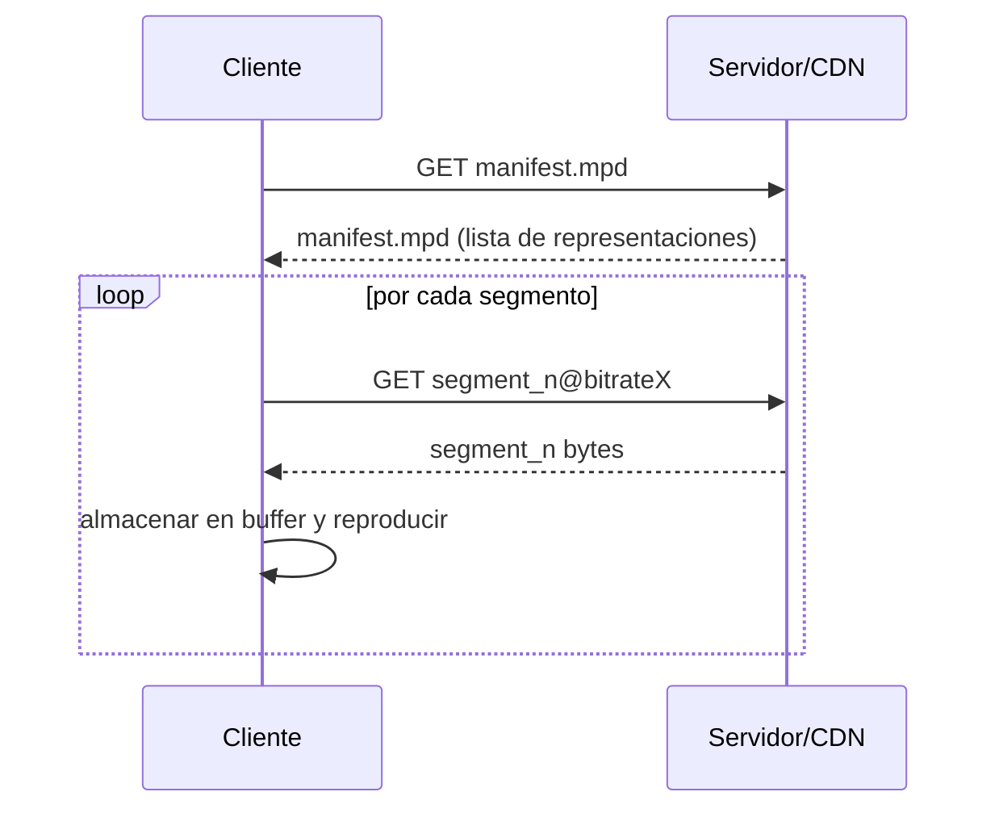

# Flujos A/V almacenado — Técnicas de entrega y adaptación

Esta unidad explica las principales soluciones para entregar contenido de audio y vídeo almacenado a través de redes IP: streaming UDP a tasa constante, streaming HTTP con buffering, DASH (Dynamic Adaptive Streaming over HTTP) y redes de distribución de contenidos (CDN). Incluye diagramas, ventajas/desventajas y notas técnicas útiles para implementar o evaluar cada solución.

---

## Resumen rápido

- UDP Streaming (tasa constante): baja latencia pero sensible a pérdida y variaciones en ancho de banda; útil en redes controladas.
- HTTP Streaming (prefetch + buffering): sencillo sobre infraestructura web existente; tolera pérdidas mediante buffering pero añade retardo inicial.
- DASH (Adaptive HTTP): cliente adapta la calidad según ancho de banda disponible; combina escalabilidad de HTTP con adaptación a red variable.
- CDNs: redes de caches distribuidas para acercar contenido al usuario y reducir latencia/uso de enlace troncal.

---

## 1. UDP Streaming a tasa constante

Descripción:

- El servidor envía paquetes UDP a una tasa constante igual a la tasa de reproducción prevista (por ejemplo, 500 kbps). El cliente recibe y reproduce a esa tasa.
- A menudo se emplea RTP para encapsular los paquetes y llevar secuencia/timestamp.

Diagrama (flujo básico):

```mermaid
flowchart LR
  S[Servidor A/V] -->|RTP/UDP (const rate)| N[Internet (best-effort)] --> C[Cliente / Player]
```

Ventajas:

- Latencia baja (no hay retransmisiones).
- Sencillo de implementar en entornos controlados.

Desventajas y problemas prácticos:

- Si el ancho de banda entre servidor y cliente cae por debajo de la tasa, se producirán pérdidas y pausas.
- Internet es variable; por ello esta técnica solo es robusta cuando la calidad del enlace es estable o cuando se usan técnicas complementarias (FEC, interleaving).
- Firewalls y NAT pueden bloquear tráfico UDP en puertos arbitrarios.

Notas técnicas:

- Combine con FEC o interleaving para tolerar pérdidas.
- RTP añade secuencia y timestamps que facilitan reordenado y cálculo de jitter.

---

## 2. HTTP Streaming con buffering (prefetch)

Descripción:

- El cliente solicita el fichero A/V (o un metafile) vía HTTP. El servidor entrega los datos sobre TCP; el cliente suele almacenar (prefetch) parte del fichero en un buffer y empieza la reproducción tras un retardo inicial (2–5 s habitual).

Diagrama:

```mermaid
flowchart LR
  Browser/Player -->|HTTP GET metafile| WebServer
  WebServer -->|HTTP response: metafile| Browser/Player
  Browser/Player -->|HTTP GET A/V segments| WebServer
  Browser/Player -->|buffer (prefetch)| Playback
```

Ventajas:

- Usa infraestructura HTTP existente (CDNs, caches, proxies), fácil de atravesar firewalls.
- TCP garantiza entrega de paquetes (no pérdidas a nivel aplicación): mayor integridad de datos.

Desventajas:

- Puede incrementar la latencia inicial (buffering requerido).
- TCP retransmisiones y control de congestión introducen variabilidad en la tasa; si la tasa de llegada cae por debajo de la tasa de reproducción, el buffer puede vaciarse.

Notas técnicas:

- Ajustar tamaño del buffer según la calidad objetivo y la variabilidad de la red.
- Para transmisión tipo "live" la latencia inicial debe minimizarse; para VOD (Video on Demand) se puede permitir mayor buffer.

---

## 3. DASH — Dynamic Adaptive Streaming over HTTP

Descripción:

- DASH divide el vídeo en segmentos temporales (chunks) codificados a varias calidades/bitrates. Un manifiesto (MPD) contiene las URL de los segmentos y las representaciones disponibles.
- El cliente monitoriza el ancho de banda y selecciona la representación adecuada para cada segmento, adaptando la calidad en tiempo real.

Diagrama (cliente adaptativo):



Ventajas:

- Escalable (se apoya en HTTP y CDNs).
- Robusto frente a fluctuaciones de ancho de banda: cliente adapta calidad para evitar pausas.
- Sencillo paso a través de firewalls y proxies (usa HTTP/TCP).

Desventajas:

- Latencia de adaptación (la tasa nominal puede cambiar entre segmentos).
- Complejidad en el cliente (algoritmos de estimación de ancho de banda y switching entre representaciones).

Notas técnicas y recomendaciones:

- Tamaño de segmento típico: 2–10 s (trade-off entre latencia de adaptación y overhead).
- Estrategias de adaptación: algoritmo reactivo (basado en throughput observado) vs predictivo (buffer-aware).
- Implementar recuperación de errores y reintentos con backoff para peticiones HTTP fallidas.

---

## 4. Redes de Distribución de Contenidos (CDN)

Descripción:

- Los CDNs replican y cachean el contenido en múltiples puntos de presencia (PoPs) cerca del usuario final.
- Dos modelos operativos:
  - "Enter Deep": muchos clusters de terceros distribuidos (gran dispersión de cache).
  - "Bring Home": pocos clusters propios y más control sobre infraestructura.

Diagrama CDN simple:

```mermaid
flowchart LR
  User --> EdgeCache1
  EdgeCache1 -->|if missing| OriginServer
  OriginServer --> EdgeCache1 --> User
  note right of EdgeCache1: réplica local reduce latencia/trafico
```

Ventajas:

- Menor latencia y menor uso de enlaces troncales (backbone).
- Escalabilidad masiva: el tráfico se sirve desde caches locales.

Consideraciones técnicas:

- Políticas de cache (TTL, invalidación) y consistencia.
- Balanceo de carga entre PoPs y geolocalización para selección de cache.
- Integración con DASH: los segmentos se alojan en caches y sirven a clientes adaptativos.

---

## 5. Comparativa y elección práctica

- **Baja latencia en redes controladas**: UDP/RTP con FEC e interleaving.
- **Video on Demand escalable y robusto**: HTTP/DASH + CDN.
- **Sencillez y compatibilidad con infra existente**: HTTP streaming (prefetch).

---

## 6. Notas de implementación y seguridad

- Firewalls/NAT: HTTP y DASH suelen atravesarlos con más facilidad que UDP puro.
- TLS/HTTPS: cifrar el tráfico HTTP/DASH para proteger contenido y evitar inyecciones/mitm.
- Licencias y DRM: en producción, considerar sistemas de protección de contenido (Widevine, PlayReady).

---

## 7. Ejercicios sugeridos

1. Diseñe un manifiesto DASH simple (MPD) con 3 representaciones (240p/480p/720p) y explique cómo el cliente decide cambiar entre ellas.
2. Compare la latencia inicial y la probabilidad de pausas para UDP streaming a 500 kbps frente a HTTP streaming con buffer de 4 s en condiciones de pérdida del 1%.
3. Proponga una política de caching TTL adecuada para segmentos DASH en un CDN global.

---

*Archivo generado a partir de `unit8.txt` y enriquecido para uso docente: contenido en Markdown, sin emoticonos, con diagramas e indicaciones técnicas.*