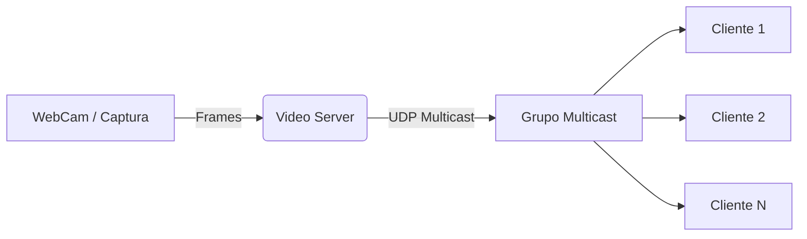

Universidad Politécnica de Cartagena

Escuela Técnica Superior de Ingeniería de Telecomunicación

# LABORATORIO DE CONTENIDOS DIGITALES

## Práctica 4 — Servicio de Videoconferencia (Multicast UDP)

**Profesor:** Antonio Javier García Sánchez

### Resumen

En esta práctica se implementa una videoconferencia basada en comunicaciones Multicast UDP. La aplicación principal consta de:

- Un servidor de vídeo que captura imágenes desde una cámara y las difunde a un grupo multicast.
- El servidor envía los fragmentos de imagen por UDP.
- Los clientes se unen al grupo multicast, reciben los datagramas, reconstruyen las imágenes y las muestran al usuario.

La práctica utiliza la librería DirectShow (incluida en Visual Studio 2017) para el tratamiento y captura de vídeo en tiempo real.

### Arquitectura




## 1. Video Streaming Server

El servidor debe capturar vídeo de la cámara, unir/crear un grupo multicast y enviar las imágenes (en formato JPEG) por UDP.

### A) Captura de vídeo (WebCam)

Recomendado: añadir la siguiente directiva

```csharp
using System.Drawing.Imaging;
```

Detección de cámaras disponibles (ejemplo):

```csharp
foreach (Camera cam in CameraService.AvailableCameras)
{
	// listar/seleccionar cámaras
}
```

Variables globales típicas:

```csharp
private CameraFrameSource _frameSource;
private static Bitmap _latestFrame;
```

Inicialización de la captura (ejemplo):

```csharp
Camera c = (Camera)comboBoxCameras.SelectedItem;
setFrameSource(new CameraFrameSource(c));
_frameSource.Camera.CaptureWidth = 320;
_frameSource.Camera.CaptureHeight = 240;
_frameSource.Camera.Fps = 20;
_frameSource.NewFrame += OnImageCaptured;
_frameSource.StartFrameCapture();

pictureBoxDisplay.Paint += new PaintEventHandler(drawLatestImage);
```

Manejador de nuevo frame:

```csharp
public void OnImageCaptured(Touchless.Vision.Contracts.IFrameSource frameSource,
							 Touchless.Vision.Contracts.Frame frame,
							 double fps)
{
	_latestFrame = frame.Image;
	pictureBoxDisplay.Invalidate();
}
```

Renderizado en el control (redimensionar si es necesario):

```csharp
private static Bitmap _latestFrame;
private void drawLatestImage(object sender, PaintEventArgs e)
{
	if (_latestFrame != null)
	{
		// redimensionar a 320x240 si es necesario
		e.Graphics.DrawImage(_latestFrame, 0, 0, _latestFrame.Width, _latestFrame.Height);
		// aquí se podría invocar el envío por multicast
	}
}

// para redimensionar:
// var resized = new Bitmap(bitmapOld, new Size(newWidth, newHeight));
```

### B) Comunicaciones Multicast UDP

Requisitos principales:

- Unirse/crear grupo multicast.
- Enviar imágenes en formato JPEG.

Usings recomendados:

```csharp
using System.Net;
using System.Net.Sockets;
using System.IO;
```

Crear y unirse a un grupo multicast (servidor):

```csharp
UdpClient udpServer = new UdpClient();
IPAddress multicastAddress = IPAddress.Parse("224.0.0.1");
udpServer.JoinMulticastGroup(multicastAddress);

IPEndPoint remote = new IPEndPoint(multicastAddress, UDP_PORT);
```

Enviar datagrama UDP con una imagen JPEG (ejemplo):

```csharp
// 'buffer' contiene bytes JPEG (MemoryStream.ToArray())
udpServer.Send(buffer, buffer.Length, remote);
```

Conversión de Bitmap a JPEG usando MemoryStream:

```csharp
using (var ms = new MemoryStream())
{
	_latestFrame.Save(ms, ImageFormat.Jpeg);
	byte[] buffer = ms.ToArray();
	udpServer.Send(buffer, buffer.Length, remote);
}
```

## 2. Cliente de vídeo

El cliente se une al grupo multicast, recibe datagramas, reconstruye el JPEG y lo muestra.

### A) Comunicaciones Multicast UDP (cliente)

```csharp
IPEndPoint localEp = new IPEndPoint(IPAddress.Any, UDP_PORT);
// configurar socket para reutilizar puerto / aceptar tráfico multicast
// cliente.SetSocketOption(...); client.Bind(localEp);

Byte[] buffer = udpClient.Receive(ref localEp);
```

Los bytes recibidos se colocan en un MemoryStream y se reconstruyen en una Image:

```csharp
using (var ms = new MemoryStream(buffer))
{
	var img = Image.FromStream(ms); // .NET detecta JPEG automáticamente
	pictureBoxDisplay.Image = img;
}
```

### B) Visualización

Asignar la Image del control para mostrar el frame. Evitar bloquear el hilo UI: use Task/Thread.

Ejemplo con Task:

```csharp
Task t1 = new Task(visualizar_imagen);
t1.Start();

private void visualizar_imagen()
{
	while (true)
	{
		try
		{
			// recepción y procesamiento
		}
		catch (Exception) { /* manejo */ }
	}
}
```

## 3. Evaluación de prestaciones (medición)

En esta parte se obliga a empaquetar vídeo en paquetes con una cabecera mínima que incluya:

- número de imagen
- número de secuencia del paquete dentro de esa imagen
- timestamp

Cada paquete contendrá la cabecera + payload (fragmento de JPEG). Requisitos de evaluación:

1) En el emisor: elegir tamaño óptimo de payload para una visualización fluida.
2) En el receptor: leer cabeceras para medir latencia, jitter y paquetes perdidos; mostrar métricas gráficamente; recomponer la imagen JPEG a partir de payloads.
3) Opcional: implementar RTP como protocolo de transporte.

Se recomienda generar gráficas (latencia/jitter/paquetes perdidos) en tiempo real o mediante logs.

### ANEXO 1 — Chat Multicast UDP

1. Aplicación Servidora

Requisitos:

- Crear y unirse a un grupo multicast.
- Recibir datos de clientes.
- Mostrar mensajes entrantes en una interfaz (ListBox historial, TextBox último mensaje).

Ejemplo de creación de grupo multicast:

```csharp
UdpClient udpClient = new UdpClient(8080);
IPAddress multicastAddress = IPAddress.Parse("224.0.0.1");
udpClient.JoinMulticastGroup(multicastAddress);

IPEndPoint remote = null;
```

Recepción de datos: usar Receive en un hilo dedicado (Thread o Task) para evitar bloquear la UI.

Thread de ejemplo:

```csharp
Thread t = new Thread(new ThreadStart(MyThreadMethod));
t.Start();

private void MyThreadMethod()
{
	while (true)
	{
		// Código de recepción de datos
	}
}
```

2. Aplicación Cliente

Requisitos:

- Unirse al grupo multicast.
- Enviar mensajes (p. ej. desde un RichTextBox cuando el usuario pulsa enviar).

Enviar mensaje:

```csharp
byte[] data = Encoding.Unicode.GetBytes(message);
udpClient.Send(data, data.Length, remoteEndpoint);
```

### ANEXO 2 — Transmisión de audio (Codificación A-law)

Objetivo: transmitir audio desde un micrófono a un host remoto usando UDP + A-law.

Usings y dependencias recomendadas:

```csharp
using ALaw;
using NAudio.Wave;
using NAudio.CoreAudioApi;
// Requiere paquete NuGet: NAudio
```

1. Formato de audio (sugerido)

- Channels = 1 (mono)
- BitsPerSample = 16
- SamplesPerSecond = 22050 (o 8000 en algunos ejemplos)
- Codificación PCM

Ejemplo de inicialización de captura con NAudio:

```csharp
private void listBox1_SelectedIndexChanged(object sender, EventArgs e)
{
	WaveIn waveIn = new WaveIn();
	int inputDeviceNumber = listBox1.SelectedIndex;
	waveIn.BufferMilliseconds = 50;
	waveIn.DeviceNumber = inputDeviceNumber;
	waveIn.WaveFormat = new WaveFormat(8000, 16, 1);
	waveIn.DataAvailable += OnAudioCaptured;
	waveIn.StartRecording();
}
```

2. Captura y envío (ejemplo):

```csharp
void OnAudioCaptured(object sender, WaveInEventArgs e)
{
	byte[] encoded = ALawEncoder.ALawEncode(e.Buffer);
	udpSender.Send(encoded, encoded.Length, endPoint);
}
```

Nota: el código del codificador/decodificador A-law puede ser proporcionado por el profesor; A-law reduce el tamaño del buffer aproximadamente a la mitad.

3. Reproducción en receptor

Crear WaveOut y BufferedWaveProvider con la misma WaveFormat usada en captura:

```csharp
waveOut = new WaveOut();
waveProvider = new BufferedWaveProvider(new WaveFormat(8000, 16, 1));
waveProvider.DiscardOnBufferOverflow = true;
```

Listener thread (ejemplo de flujo):

```csharp
private void ListenerThread(object state)
{
	var endPoint = (IPEndPoint)state;
	try
	{
		waveOut.Init(waveProvider);
		waveOut.Play();
		while (listening)
		{
			byte[] b = clientAudio.Receive(ref endPoint);
			byte[] payload = DeserializeHeader(b, false); // Implementar por el alumno
			short[] decoded = ALawDecoder.ALawDecode(payload);
			byte[] result = new byte[decoded.Length * 2];
			Buffer.BlockCopy(decoded, 0, result, 0, result.Length);
			waveProvider.AddSamples(result, 0, result.Length);
		}
	}
	catch (SocketException)
	{
		// manejar excepción
	}
}
```

---

### Notas finales y recomendaciones

- Evite bloquear el hilo de la UI: use Tasks o Threads para recepción y procesamiento de red.
- Documente claramente el formato de la cabecera de cada paquete para que receptor y emisor coincidan.
- Para la evaluación, registre métricas (latencia, jitter, paquetes perdidos) y presente resultados gráficamente.

Fin del documento.

